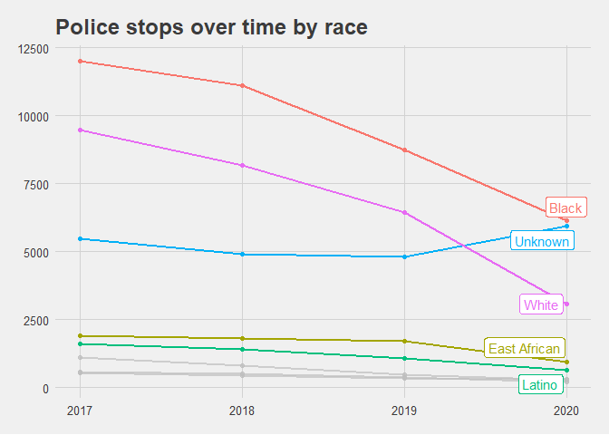
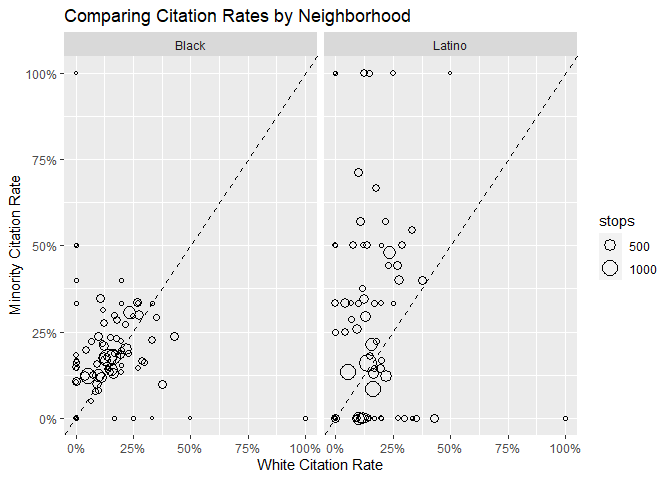
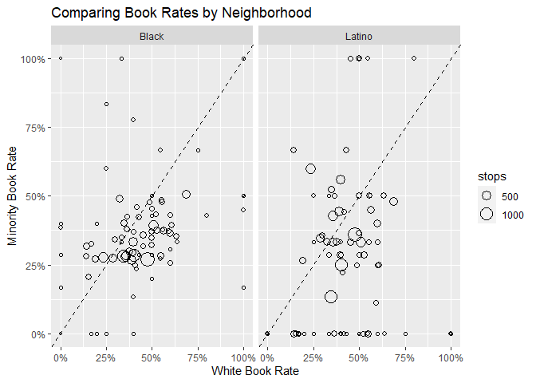

Mpls Police Stop Data
================
Richard Bamattre
2020-12-22

**Purpose**

Apply Stanford’s Open Policing methodology on Mpls Police Data.

<https://openpolicing.stanford.edu/>

They have an R script for Saint Paul but not Mpls.

**Description**

**Data Sources**

Minneapolis Police Stop Data:
<https://opendata.minneapolismn.gov/datasets/police-stop-data>

*Other Notes*

*Change log*

``` r
## Load libraries

# read
library(tidycensus); census_api_key("0c5d9fddc67544f23d3fa524660c9d81d4be2c90") # add API key here

# wrangle
library(tidyverse)
library(lubridate) # work with dates and times

# viz
library(janitor) # clean names and make nice tables
library(gghighlight)
library(ggthemes)
library(gt) # nice tables

# model
library(sf) # GIS

# export

## Custom functions

knitr::opts_chunk$set(warning = FALSE, message = FALSE)
```

# Read

Get police stop data.

Use an API link (ArcGIS) to directly download the latest geojson using
st\_read

Looking at the first rows of the data:

``` r
stop <- st_read("https://opendata.arcgis.com/datasets/215b4b543d894750aef86c725b56ee2a_0.geojson")
```

    ## Reading layer `Police_Stop_Data' from data source `https://opendata.arcgis.com/datasets/215b4b543d894750aef86c725b56ee2a_0.geojson' using driver `GeoJSON'
    ## Simple feature collection with 171935 features and 19 fields
    ## geometry type:  POINT
    ## dimension:      XY
    ## bbox:           xmin: -93.32915 ymin: 0 xmax: 0 ymax: 45.05124
    ## geographic CRS: WGS 84

``` r
head(stop)
```

    ## Simple feature collection with 6 features and 19 fields
    ## geometry type:  POINT
    ## dimension:      XY
    ## bbox:           xmin: -93.28807 ymin: 44.90617 xmax: -93.24741 ymax: 45.02484
    ## geographic CRS: WGS 84
    ##   OBJECTID masterIncidentNumber        responseDate reason
    ## 1        1            16-395258 2016-10-31 17:40:47       
    ## 2        2            16-395296 2016-10-31 18:06:36       
    ## 3        3            16-395326 2016-10-31 18:20:54       
    ## 4        4            16-395328 2016-10-31 18:23:20       
    ## 5        5            16-395333 2016-10-31 18:26:05       
    ## 6        6            16-395364 2016-10-31 18:45:31   <NA>
    ##                       problem     callDisposition citationIssued personSearch
    ## 1       Suspicious Person (P)         BKG-Booking                         YES
    ## 2 Traffic Law Enforcement (P)          TAG-Tagged                          NO
    ## 3         Attempt Pick-Up (P)         RFD-Refused                          NO
    ## 4       Suspicious Person (P)         BKG-Booking                         YES
    ## 5      Suspicious Vehicle (P) GOA-Gone on Arrival                          NO
    ## 6 Traffic Law Enforcement (P)         ADV-Advised           <NA>         <NA>
    ##   vehicleSearch preRace    race  gender      lat      long         x       y
    ## 1            NO   Black   Black    Male 44.97957 -93.27257 -10383055 5618306
    ## 2            NO Unknown   Black    Male 44.96269 -93.27592 -10383428 5615650
    ## 3            NO Unknown Unknown Unknown 45.02484 -93.28807 -10384780 5625432
    ## 4            NO   Black   Black    Male 44.94656 -93.24741 -10380254 5613112
    ## 5            NO   Other Unknown    Male 44.90617 -93.25501 -10381100 5606762
    ## 6          <NA>    <NA>    <NA>    <NA> 44.93954 -93.27791 -10383650 5612008
    ##   policePrecinct                     neighborhood      lastUpdateDate
    ## 1              1                    Downtown West 2017-08-08 05:25:31
    ## 2              5 Steven's Square - Loring Heights 2017-08-08 05:26:13
    ## 3              4                  Webber - Camden 2017-08-08 05:24:35
    ## 4              3                         Corcoran 2017-08-08 05:25:31
    ## 5              3                             Hale 2017-08-08 05:25:03
    ## 6              5                          Lyndale 2017-08-08 05:25:31
    ##                     geometry
    ## 1 POINT (-93.27257 44.97957)
    ## 2 POINT (-93.27592 44.96269)
    ## 3 POINT (-93.28807 45.02484)
    ## 4 POINT (-93.24741 44.94656)
    ## 5 POINT (-93.25501 44.90617)
    ## 6 POINT (-93.27791 44.93954)

# Overview of the Data

How many total stops? Distinct count of master incident numbers.

``` r
n_distinct(stop$masterIncidentNumber)
```

    ## [1] 171935

What’s the date range?

``` r
min(stop$responseDate)
```

    ## [1] "2016-10-31 17:40:47 CDT"

``` r
max(stop$responseDate)
```

    ## [1] "2021-01-12 21:26:47 CST"

Let’s focus on 2016-2020. Convert from sf to a tibble - faster to work
with, and can join geometry back later on.

``` r
stop2 <- stop %>%
  filter(year(responseDate) >= 2017,
         year(responseDate) < 2021) %>%
  as_tibble() %>%
  select(-geometry)
```

For now, look at vehicular stops. Try doing pedestrian stops later.

``` r
stop2 %>% 
  tabyl(reason) %>% 
  adorn_pct_formatting() %>%
  gt()
```

<!--html_preserve-->

<style>html {
  font-family: -apple-system, BlinkMacSystemFont, 'Segoe UI', Roboto, Oxygen, Ubuntu, Cantarell, 'Helvetica Neue', 'Fira Sans', 'Droid Sans', Arial, sans-serif;
}

#uqtnqxhswk .gt_table {
  display: table;
  border-collapse: collapse;
  margin-left: auto;
  margin-right: auto;
  color: #333333;
  font-size: 16px;
  font-weight: normal;
  font-style: normal;
  background-color: #FFFFFF;
  width: auto;
  border-top-style: solid;
  border-top-width: 2px;
  border-top-color: #A8A8A8;
  border-right-style: none;
  border-right-width: 2px;
  border-right-color: #D3D3D3;
  border-bottom-style: solid;
  border-bottom-width: 2px;
  border-bottom-color: #A8A8A8;
  border-left-style: none;
  border-left-width: 2px;
  border-left-color: #D3D3D3;
}

#uqtnqxhswk .gt_heading {
  background-color: #FFFFFF;
  text-align: center;
  border-bottom-color: #FFFFFF;
  border-left-style: none;
  border-left-width: 1px;
  border-left-color: #D3D3D3;
  border-right-style: none;
  border-right-width: 1px;
  border-right-color: #D3D3D3;
}

#uqtnqxhswk .gt_title {
  color: #333333;
  font-size: 125%;
  font-weight: initial;
  padding-top: 4px;
  padding-bottom: 4px;
  border-bottom-color: #FFFFFF;
  border-bottom-width: 0;
}

#uqtnqxhswk .gt_subtitle {
  color: #333333;
  font-size: 85%;
  font-weight: initial;
  padding-top: 0;
  padding-bottom: 4px;
  border-top-color: #FFFFFF;
  border-top-width: 0;
}

#uqtnqxhswk .gt_bottom_border {
  border-bottom-style: solid;
  border-bottom-width: 2px;
  border-bottom-color: #D3D3D3;
}

#uqtnqxhswk .gt_col_headings {
  border-top-style: solid;
  border-top-width: 2px;
  border-top-color: #D3D3D3;
  border-bottom-style: solid;
  border-bottom-width: 2px;
  border-bottom-color: #D3D3D3;
  border-left-style: none;
  border-left-width: 1px;
  border-left-color: #D3D3D3;
  border-right-style: none;
  border-right-width: 1px;
  border-right-color: #D3D3D3;
}

#uqtnqxhswk .gt_col_heading {
  color: #333333;
  background-color: #FFFFFF;
  font-size: 100%;
  font-weight: normal;
  text-transform: inherit;
  border-left-style: none;
  border-left-width: 1px;
  border-left-color: #D3D3D3;
  border-right-style: none;
  border-right-width: 1px;
  border-right-color: #D3D3D3;
  vertical-align: bottom;
  padding-top: 5px;
  padding-bottom: 6px;
  padding-left: 5px;
  padding-right: 5px;
  overflow-x: hidden;
}

#uqtnqxhswk .gt_column_spanner_outer {
  color: #333333;
  background-color: #FFFFFF;
  font-size: 100%;
  font-weight: normal;
  text-transform: inherit;
  padding-top: 0;
  padding-bottom: 0;
  padding-left: 4px;
  padding-right: 4px;
}

#uqtnqxhswk .gt_column_spanner_outer:first-child {
  padding-left: 0;
}

#uqtnqxhswk .gt_column_spanner_outer:last-child {
  padding-right: 0;
}

#uqtnqxhswk .gt_column_spanner {
  border-bottom-style: solid;
  border-bottom-width: 2px;
  border-bottom-color: #D3D3D3;
  vertical-align: bottom;
  padding-top: 5px;
  padding-bottom: 6px;
  overflow-x: hidden;
  display: inline-block;
  width: 100%;
}

#uqtnqxhswk .gt_group_heading {
  padding: 8px;
  color: #333333;
  background-color: #FFFFFF;
  font-size: 100%;
  font-weight: initial;
  text-transform: inherit;
  border-top-style: solid;
  border-top-width: 2px;
  border-top-color: #D3D3D3;
  border-bottom-style: solid;
  border-bottom-width: 2px;
  border-bottom-color: #D3D3D3;
  border-left-style: none;
  border-left-width: 1px;
  border-left-color: #D3D3D3;
  border-right-style: none;
  border-right-width: 1px;
  border-right-color: #D3D3D3;
  vertical-align: middle;
}

#uqtnqxhswk .gt_empty_group_heading {
  padding: 0.5px;
  color: #333333;
  background-color: #FFFFFF;
  font-size: 100%;
  font-weight: initial;
  border-top-style: solid;
  border-top-width: 2px;
  border-top-color: #D3D3D3;
  border-bottom-style: solid;
  border-bottom-width: 2px;
  border-bottom-color: #D3D3D3;
  vertical-align: middle;
}

#uqtnqxhswk .gt_from_md > :first-child {
  margin-top: 0;
}

#uqtnqxhswk .gt_from_md > :last-child {
  margin-bottom: 0;
}

#uqtnqxhswk .gt_row {
  padding-top: 8px;
  padding-bottom: 8px;
  padding-left: 5px;
  padding-right: 5px;
  margin: 10px;
  border-top-style: solid;
  border-top-width: 1px;
  border-top-color: #D3D3D3;
  border-left-style: none;
  border-left-width: 1px;
  border-left-color: #D3D3D3;
  border-right-style: none;
  border-right-width: 1px;
  border-right-color: #D3D3D3;
  vertical-align: middle;
  overflow-x: hidden;
}

#uqtnqxhswk .gt_stub {
  color: #333333;
  background-color: #FFFFFF;
  font-size: 100%;
  font-weight: initial;
  text-transform: inherit;
  border-right-style: solid;
  border-right-width: 2px;
  border-right-color: #D3D3D3;
  padding-left: 12px;
}

#uqtnqxhswk .gt_summary_row {
  color: #333333;
  background-color: #FFFFFF;
  text-transform: inherit;
  padding-top: 8px;
  padding-bottom: 8px;
  padding-left: 5px;
  padding-right: 5px;
}

#uqtnqxhswk .gt_first_summary_row {
  padding-top: 8px;
  padding-bottom: 8px;
  padding-left: 5px;
  padding-right: 5px;
  border-top-style: solid;
  border-top-width: 2px;
  border-top-color: #D3D3D3;
}

#uqtnqxhswk .gt_grand_summary_row {
  color: #333333;
  background-color: #FFFFFF;
  text-transform: inherit;
  padding-top: 8px;
  padding-bottom: 8px;
  padding-left: 5px;
  padding-right: 5px;
}

#uqtnqxhswk .gt_first_grand_summary_row {
  padding-top: 8px;
  padding-bottom: 8px;
  padding-left: 5px;
  padding-right: 5px;
  border-top-style: double;
  border-top-width: 6px;
  border-top-color: #D3D3D3;
}

#uqtnqxhswk .gt_striped {
  background-color: rgba(128, 128, 128, 0.05);
}

#uqtnqxhswk .gt_table_body {
  border-top-style: solid;
  border-top-width: 2px;
  border-top-color: #D3D3D3;
  border-bottom-style: solid;
  border-bottom-width: 2px;
  border-bottom-color: #D3D3D3;
}

#uqtnqxhswk .gt_footnotes {
  color: #333333;
  background-color: #FFFFFF;
  border-bottom-style: none;
  border-bottom-width: 2px;
  border-bottom-color: #D3D3D3;
  border-left-style: none;
  border-left-width: 2px;
  border-left-color: #D3D3D3;
  border-right-style: none;
  border-right-width: 2px;
  border-right-color: #D3D3D3;
}

#uqtnqxhswk .gt_footnote {
  margin: 0px;
  font-size: 90%;
  padding: 4px;
}

#uqtnqxhswk .gt_sourcenotes {
  color: #333333;
  background-color: #FFFFFF;
  border-bottom-style: none;
  border-bottom-width: 2px;
  border-bottom-color: #D3D3D3;
  border-left-style: none;
  border-left-width: 2px;
  border-left-color: #D3D3D3;
  border-right-style: none;
  border-right-width: 2px;
  border-right-color: #D3D3D3;
}

#uqtnqxhswk .gt_sourcenote {
  font-size: 90%;
  padding: 4px;
}

#uqtnqxhswk .gt_left {
  text-align: left;
}

#uqtnqxhswk .gt_center {
  text-align: center;
}

#uqtnqxhswk .gt_right {
  text-align: right;
  font-variant-numeric: tabular-nums;
}

#uqtnqxhswk .gt_font_normal {
  font-weight: normal;
}

#uqtnqxhswk .gt_font_bold {
  font-weight: bold;
}

#uqtnqxhswk .gt_font_italic {
  font-style: italic;
}

#uqtnqxhswk .gt_super {
  font-size: 65%;
}

#uqtnqxhswk .gt_footnote_marks {
  font-style: italic;
  font-size: 65%;
}
</style>

<div id="uqtnqxhswk" style="overflow-x:auto;overflow-y:auto;width:auto;height:auto;">

<table class="gt_table">

<thead class="gt_col_headings">

<tr>

<th class="gt_col_heading gt_columns_bottom_border gt_left" rowspan="1" colspan="1">

reason

</th>

<th class="gt_col_heading gt_columns_bottom_border gt_right" rowspan="1" colspan="1">

n

</th>

<th class="gt_col_heading gt_columns_bottom_border gt_left" rowspan="1" colspan="1">

percent

</th>

<th class="gt_col_heading gt_columns_bottom_border gt_left" rowspan="1" colspan="1">

valid\_percent

</th>

</tr>

</thead>

<tbody class="gt_table_body">

<tr>

<td class="gt_row gt_left">

</td>

<td class="gt_row gt_right">

10432

</td>

<td class="gt_row gt_left">

6.3%

</td>

<td class="gt_row gt_left">

7.2%

</td>

</tr>

<tr>

<td class="gt_row gt_left">

Citizen / 9-1-1

</td>

<td class="gt_row gt_right">

42854

</td>

<td class="gt_row gt_left">

26.0%

</td>

<td class="gt_row gt_left">

29.6%

</td>

</tr>

<tr>

<td class="gt_row gt_left">

Equipment Violation

</td>

<td class="gt_row gt_right">

20871

</td>

<td class="gt_row gt_left">

12.7%

</td>

<td class="gt_row gt_left">

14.4%

</td>

</tr>

<tr>

<td class="gt_row gt_left">

Investigative

</td>

<td class="gt_row gt_right">

28823

</td>

<td class="gt_row gt_left">

17.5%

</td>

<td class="gt_row gt_left">

19.9%

</td>

</tr>

<tr>

<td class="gt_row gt_left">

Moving Violation

</td>

<td class="gt_row gt_right">

41674

</td>

<td class="gt_row gt_left">

25.3%

</td>

<td class="gt_row gt_left">

28.8%

</td>

</tr>

<tr>

<td class="gt_row gt_left">

NA

</td>

<td class="gt_row gt_right">

19887

</td>

<td class="gt_row gt_left">

12.1%

</td>

<td class="gt_row gt_left">

\-

</td>

</tr>

</tbody>

</table>

</div>

<!--/html_preserve-->

``` r
stop2 %>% 
  tabyl(problem) %>% 
  adorn_pct_formatting() %>%
  gt()
```

<!--html_preserve-->

<style>html {
  font-family: -apple-system, BlinkMacSystemFont, 'Segoe UI', Roboto, Oxygen, Ubuntu, Cantarell, 'Helvetica Neue', 'Fira Sans', 'Droid Sans', Arial, sans-serif;
}

#tbkeupdzoc .gt_table {
  display: table;
  border-collapse: collapse;
  margin-left: auto;
  margin-right: auto;
  color: #333333;
  font-size: 16px;
  font-weight: normal;
  font-style: normal;
  background-color: #FFFFFF;
  width: auto;
  border-top-style: solid;
  border-top-width: 2px;
  border-top-color: #A8A8A8;
  border-right-style: none;
  border-right-width: 2px;
  border-right-color: #D3D3D3;
  border-bottom-style: solid;
  border-bottom-width: 2px;
  border-bottom-color: #A8A8A8;
  border-left-style: none;
  border-left-width: 2px;
  border-left-color: #D3D3D3;
}

#tbkeupdzoc .gt_heading {
  background-color: #FFFFFF;
  text-align: center;
  border-bottom-color: #FFFFFF;
  border-left-style: none;
  border-left-width: 1px;
  border-left-color: #D3D3D3;
  border-right-style: none;
  border-right-width: 1px;
  border-right-color: #D3D3D3;
}

#tbkeupdzoc .gt_title {
  color: #333333;
  font-size: 125%;
  font-weight: initial;
  padding-top: 4px;
  padding-bottom: 4px;
  border-bottom-color: #FFFFFF;
  border-bottom-width: 0;
}

#tbkeupdzoc .gt_subtitle {
  color: #333333;
  font-size: 85%;
  font-weight: initial;
  padding-top: 0;
  padding-bottom: 4px;
  border-top-color: #FFFFFF;
  border-top-width: 0;
}

#tbkeupdzoc .gt_bottom_border {
  border-bottom-style: solid;
  border-bottom-width: 2px;
  border-bottom-color: #D3D3D3;
}

#tbkeupdzoc .gt_col_headings {
  border-top-style: solid;
  border-top-width: 2px;
  border-top-color: #D3D3D3;
  border-bottom-style: solid;
  border-bottom-width: 2px;
  border-bottom-color: #D3D3D3;
  border-left-style: none;
  border-left-width: 1px;
  border-left-color: #D3D3D3;
  border-right-style: none;
  border-right-width: 1px;
  border-right-color: #D3D3D3;
}

#tbkeupdzoc .gt_col_heading {
  color: #333333;
  background-color: #FFFFFF;
  font-size: 100%;
  font-weight: normal;
  text-transform: inherit;
  border-left-style: none;
  border-left-width: 1px;
  border-left-color: #D3D3D3;
  border-right-style: none;
  border-right-width: 1px;
  border-right-color: #D3D3D3;
  vertical-align: bottom;
  padding-top: 5px;
  padding-bottom: 6px;
  padding-left: 5px;
  padding-right: 5px;
  overflow-x: hidden;
}

#tbkeupdzoc .gt_column_spanner_outer {
  color: #333333;
  background-color: #FFFFFF;
  font-size: 100%;
  font-weight: normal;
  text-transform: inherit;
  padding-top: 0;
  padding-bottom: 0;
  padding-left: 4px;
  padding-right: 4px;
}

#tbkeupdzoc .gt_column_spanner_outer:first-child {
  padding-left: 0;
}

#tbkeupdzoc .gt_column_spanner_outer:last-child {
  padding-right: 0;
}

#tbkeupdzoc .gt_column_spanner {
  border-bottom-style: solid;
  border-bottom-width: 2px;
  border-bottom-color: #D3D3D3;
  vertical-align: bottom;
  padding-top: 5px;
  padding-bottom: 6px;
  overflow-x: hidden;
  display: inline-block;
  width: 100%;
}

#tbkeupdzoc .gt_group_heading {
  padding: 8px;
  color: #333333;
  background-color: #FFFFFF;
  font-size: 100%;
  font-weight: initial;
  text-transform: inherit;
  border-top-style: solid;
  border-top-width: 2px;
  border-top-color: #D3D3D3;
  border-bottom-style: solid;
  border-bottom-width: 2px;
  border-bottom-color: #D3D3D3;
  border-left-style: none;
  border-left-width: 1px;
  border-left-color: #D3D3D3;
  border-right-style: none;
  border-right-width: 1px;
  border-right-color: #D3D3D3;
  vertical-align: middle;
}

#tbkeupdzoc .gt_empty_group_heading {
  padding: 0.5px;
  color: #333333;
  background-color: #FFFFFF;
  font-size: 100%;
  font-weight: initial;
  border-top-style: solid;
  border-top-width: 2px;
  border-top-color: #D3D3D3;
  border-bottom-style: solid;
  border-bottom-width: 2px;
  border-bottom-color: #D3D3D3;
  vertical-align: middle;
}

#tbkeupdzoc .gt_from_md > :first-child {
  margin-top: 0;
}

#tbkeupdzoc .gt_from_md > :last-child {
  margin-bottom: 0;
}

#tbkeupdzoc .gt_row {
  padding-top: 8px;
  padding-bottom: 8px;
  padding-left: 5px;
  padding-right: 5px;
  margin: 10px;
  border-top-style: solid;
  border-top-width: 1px;
  border-top-color: #D3D3D3;
  border-left-style: none;
  border-left-width: 1px;
  border-left-color: #D3D3D3;
  border-right-style: none;
  border-right-width: 1px;
  border-right-color: #D3D3D3;
  vertical-align: middle;
  overflow-x: hidden;
}

#tbkeupdzoc .gt_stub {
  color: #333333;
  background-color: #FFFFFF;
  font-size: 100%;
  font-weight: initial;
  text-transform: inherit;
  border-right-style: solid;
  border-right-width: 2px;
  border-right-color: #D3D3D3;
  padding-left: 12px;
}

#tbkeupdzoc .gt_summary_row {
  color: #333333;
  background-color: #FFFFFF;
  text-transform: inherit;
  padding-top: 8px;
  padding-bottom: 8px;
  padding-left: 5px;
  padding-right: 5px;
}

#tbkeupdzoc .gt_first_summary_row {
  padding-top: 8px;
  padding-bottom: 8px;
  padding-left: 5px;
  padding-right: 5px;
  border-top-style: solid;
  border-top-width: 2px;
  border-top-color: #D3D3D3;
}

#tbkeupdzoc .gt_grand_summary_row {
  color: #333333;
  background-color: #FFFFFF;
  text-transform: inherit;
  padding-top: 8px;
  padding-bottom: 8px;
  padding-left: 5px;
  padding-right: 5px;
}

#tbkeupdzoc .gt_first_grand_summary_row {
  padding-top: 8px;
  padding-bottom: 8px;
  padding-left: 5px;
  padding-right: 5px;
  border-top-style: double;
  border-top-width: 6px;
  border-top-color: #D3D3D3;
}

#tbkeupdzoc .gt_striped {
  background-color: rgba(128, 128, 128, 0.05);
}

#tbkeupdzoc .gt_table_body {
  border-top-style: solid;
  border-top-width: 2px;
  border-top-color: #D3D3D3;
  border-bottom-style: solid;
  border-bottom-width: 2px;
  border-bottom-color: #D3D3D3;
}

#tbkeupdzoc .gt_footnotes {
  color: #333333;
  background-color: #FFFFFF;
  border-bottom-style: none;
  border-bottom-width: 2px;
  border-bottom-color: #D3D3D3;
  border-left-style: none;
  border-left-width: 2px;
  border-left-color: #D3D3D3;
  border-right-style: none;
  border-right-width: 2px;
  border-right-color: #D3D3D3;
}

#tbkeupdzoc .gt_footnote {
  margin: 0px;
  font-size: 90%;
  padding: 4px;
}

#tbkeupdzoc .gt_sourcenotes {
  color: #333333;
  background-color: #FFFFFF;
  border-bottom-style: none;
  border-bottom-width: 2px;
  border-bottom-color: #D3D3D3;
  border-left-style: none;
  border-left-width: 2px;
  border-left-color: #D3D3D3;
  border-right-style: none;
  border-right-width: 2px;
  border-right-color: #D3D3D3;
}

#tbkeupdzoc .gt_sourcenote {
  font-size: 90%;
  padding: 4px;
}

#tbkeupdzoc .gt_left {
  text-align: left;
}

#tbkeupdzoc .gt_center {
  text-align: center;
}

#tbkeupdzoc .gt_right {
  text-align: right;
  font-variant-numeric: tabular-nums;
}

#tbkeupdzoc .gt_font_normal {
  font-weight: normal;
}

#tbkeupdzoc .gt_font_bold {
  font-weight: bold;
}

#tbkeupdzoc .gt_font_italic {
  font-style: italic;
}

#tbkeupdzoc .gt_super {
  font-size: 65%;
}

#tbkeupdzoc .gt_footnote_marks {
  font-style: italic;
  font-size: 65%;
}
</style>

<div id="tbkeupdzoc" style="overflow-x:auto;overflow-y:auto;width:auto;height:auto;">

<table class="gt_table">

<thead class="gt_col_headings">

<tr>

<th class="gt_col_heading gt_columns_bottom_border gt_left" rowspan="1" colspan="1">

problem

</th>

<th class="gt_col_heading gt_columns_bottom_border gt_right" rowspan="1" colspan="1">

n

</th>

<th class="gt_col_heading gt_columns_bottom_border gt_left" rowspan="1" colspan="1">

percent

</th>

</tr>

</thead>

<tbody class="gt_table_body">

<tr>

<td class="gt_row gt_left">

Attempt Pick-Up (P)

</td>

<td class="gt_row gt_right">

3643

</td>

<td class="gt_row gt_left">

2.2%

</td>

</tr>

<tr>

<td class="gt_row gt_left">

Curfew Violations (P)

</td>

<td class="gt_row gt_right">

112

</td>

<td class="gt_row gt_left">

0.1%

</td>

</tr>

<tr>

<td class="gt_row gt_left">

Suspicious Person (P)

</td>

<td class="gt_row gt_right">

45784

</td>

<td class="gt_row gt_left">

27.8%

</td>

</tr>

<tr>

<td class="gt_row gt_left">

Suspicious Vehicle (P)

</td>

<td class="gt_row gt_right">

36458

</td>

<td class="gt_row gt_left">

22.2%

</td>

</tr>

<tr>

<td class="gt_row gt_left">

Traffic Law Enforcement (P)

</td>

<td class="gt_row gt_right">

78492

</td>

<td class="gt_row gt_left">

47.7%

</td>

</tr>

<tr>

<td class="gt_row gt_left">

Truancy (P)

</td>

<td class="gt_row gt_right">

52

</td>

<td class="gt_row gt_left">

0.0%

</td>

</tr>

</tbody>

</table>

</div>

<!--/html_preserve-->

What’s the interaction between reasons and problems?

``` r
stop2 %>% 
  tabyl(reason, problem) %>% 
  gt()
```

<!--html_preserve-->

<style>html {
  font-family: -apple-system, BlinkMacSystemFont, 'Segoe UI', Roboto, Oxygen, Ubuntu, Cantarell, 'Helvetica Neue', 'Fira Sans', 'Droid Sans', Arial, sans-serif;
}

#clmaaqbntf .gt_table {
  display: table;
  border-collapse: collapse;
  margin-left: auto;
  margin-right: auto;
  color: #333333;
  font-size: 16px;
  font-weight: normal;
  font-style: normal;
  background-color: #FFFFFF;
  width: auto;
  border-top-style: solid;
  border-top-width: 2px;
  border-top-color: #A8A8A8;
  border-right-style: none;
  border-right-width: 2px;
  border-right-color: #D3D3D3;
  border-bottom-style: solid;
  border-bottom-width: 2px;
  border-bottom-color: #A8A8A8;
  border-left-style: none;
  border-left-width: 2px;
  border-left-color: #D3D3D3;
}

#clmaaqbntf .gt_heading {
  background-color: #FFFFFF;
  text-align: center;
  border-bottom-color: #FFFFFF;
  border-left-style: none;
  border-left-width: 1px;
  border-left-color: #D3D3D3;
  border-right-style: none;
  border-right-width: 1px;
  border-right-color: #D3D3D3;
}

#clmaaqbntf .gt_title {
  color: #333333;
  font-size: 125%;
  font-weight: initial;
  padding-top: 4px;
  padding-bottom: 4px;
  border-bottom-color: #FFFFFF;
  border-bottom-width: 0;
}

#clmaaqbntf .gt_subtitle {
  color: #333333;
  font-size: 85%;
  font-weight: initial;
  padding-top: 0;
  padding-bottom: 4px;
  border-top-color: #FFFFFF;
  border-top-width: 0;
}

#clmaaqbntf .gt_bottom_border {
  border-bottom-style: solid;
  border-bottom-width: 2px;
  border-bottom-color: #D3D3D3;
}

#clmaaqbntf .gt_col_headings {
  border-top-style: solid;
  border-top-width: 2px;
  border-top-color: #D3D3D3;
  border-bottom-style: solid;
  border-bottom-width: 2px;
  border-bottom-color: #D3D3D3;
  border-left-style: none;
  border-left-width: 1px;
  border-left-color: #D3D3D3;
  border-right-style: none;
  border-right-width: 1px;
  border-right-color: #D3D3D3;
}

#clmaaqbntf .gt_col_heading {
  color: #333333;
  background-color: #FFFFFF;
  font-size: 100%;
  font-weight: normal;
  text-transform: inherit;
  border-left-style: none;
  border-left-width: 1px;
  border-left-color: #D3D3D3;
  border-right-style: none;
  border-right-width: 1px;
  border-right-color: #D3D3D3;
  vertical-align: bottom;
  padding-top: 5px;
  padding-bottom: 6px;
  padding-left: 5px;
  padding-right: 5px;
  overflow-x: hidden;
}

#clmaaqbntf .gt_column_spanner_outer {
  color: #333333;
  background-color: #FFFFFF;
  font-size: 100%;
  font-weight: normal;
  text-transform: inherit;
  padding-top: 0;
  padding-bottom: 0;
  padding-left: 4px;
  padding-right: 4px;
}

#clmaaqbntf .gt_column_spanner_outer:first-child {
  padding-left: 0;
}

#clmaaqbntf .gt_column_spanner_outer:last-child {
  padding-right: 0;
}

#clmaaqbntf .gt_column_spanner {
  border-bottom-style: solid;
  border-bottom-width: 2px;
  border-bottom-color: #D3D3D3;
  vertical-align: bottom;
  padding-top: 5px;
  padding-bottom: 6px;
  overflow-x: hidden;
  display: inline-block;
  width: 100%;
}

#clmaaqbntf .gt_group_heading {
  padding: 8px;
  color: #333333;
  background-color: #FFFFFF;
  font-size: 100%;
  font-weight: initial;
  text-transform: inherit;
  border-top-style: solid;
  border-top-width: 2px;
  border-top-color: #D3D3D3;
  border-bottom-style: solid;
  border-bottom-width: 2px;
  border-bottom-color: #D3D3D3;
  border-left-style: none;
  border-left-width: 1px;
  border-left-color: #D3D3D3;
  border-right-style: none;
  border-right-width: 1px;
  border-right-color: #D3D3D3;
  vertical-align: middle;
}

#clmaaqbntf .gt_empty_group_heading {
  padding: 0.5px;
  color: #333333;
  background-color: #FFFFFF;
  font-size: 100%;
  font-weight: initial;
  border-top-style: solid;
  border-top-width: 2px;
  border-top-color: #D3D3D3;
  border-bottom-style: solid;
  border-bottom-width: 2px;
  border-bottom-color: #D3D3D3;
  vertical-align: middle;
}

#clmaaqbntf .gt_from_md > :first-child {
  margin-top: 0;
}

#clmaaqbntf .gt_from_md > :last-child {
  margin-bottom: 0;
}

#clmaaqbntf .gt_row {
  padding-top: 8px;
  padding-bottom: 8px;
  padding-left: 5px;
  padding-right: 5px;
  margin: 10px;
  border-top-style: solid;
  border-top-width: 1px;
  border-top-color: #D3D3D3;
  border-left-style: none;
  border-left-width: 1px;
  border-left-color: #D3D3D3;
  border-right-style: none;
  border-right-width: 1px;
  border-right-color: #D3D3D3;
  vertical-align: middle;
  overflow-x: hidden;
}

#clmaaqbntf .gt_stub {
  color: #333333;
  background-color: #FFFFFF;
  font-size: 100%;
  font-weight: initial;
  text-transform: inherit;
  border-right-style: solid;
  border-right-width: 2px;
  border-right-color: #D3D3D3;
  padding-left: 12px;
}

#clmaaqbntf .gt_summary_row {
  color: #333333;
  background-color: #FFFFFF;
  text-transform: inherit;
  padding-top: 8px;
  padding-bottom: 8px;
  padding-left: 5px;
  padding-right: 5px;
}

#clmaaqbntf .gt_first_summary_row {
  padding-top: 8px;
  padding-bottom: 8px;
  padding-left: 5px;
  padding-right: 5px;
  border-top-style: solid;
  border-top-width: 2px;
  border-top-color: #D3D3D3;
}

#clmaaqbntf .gt_grand_summary_row {
  color: #333333;
  background-color: #FFFFFF;
  text-transform: inherit;
  padding-top: 8px;
  padding-bottom: 8px;
  padding-left: 5px;
  padding-right: 5px;
}

#clmaaqbntf .gt_first_grand_summary_row {
  padding-top: 8px;
  padding-bottom: 8px;
  padding-left: 5px;
  padding-right: 5px;
  border-top-style: double;
  border-top-width: 6px;
  border-top-color: #D3D3D3;
}

#clmaaqbntf .gt_striped {
  background-color: rgba(128, 128, 128, 0.05);
}

#clmaaqbntf .gt_table_body {
  border-top-style: solid;
  border-top-width: 2px;
  border-top-color: #D3D3D3;
  border-bottom-style: solid;
  border-bottom-width: 2px;
  border-bottom-color: #D3D3D3;
}

#clmaaqbntf .gt_footnotes {
  color: #333333;
  background-color: #FFFFFF;
  border-bottom-style: none;
  border-bottom-width: 2px;
  border-bottom-color: #D3D3D3;
  border-left-style: none;
  border-left-width: 2px;
  border-left-color: #D3D3D3;
  border-right-style: none;
  border-right-width: 2px;
  border-right-color: #D3D3D3;
}

#clmaaqbntf .gt_footnote {
  margin: 0px;
  font-size: 90%;
  padding: 4px;
}

#clmaaqbntf .gt_sourcenotes {
  color: #333333;
  background-color: #FFFFFF;
  border-bottom-style: none;
  border-bottom-width: 2px;
  border-bottom-color: #D3D3D3;
  border-left-style: none;
  border-left-width: 2px;
  border-left-color: #D3D3D3;
  border-right-style: none;
  border-right-width: 2px;
  border-right-color: #D3D3D3;
}

#clmaaqbntf .gt_sourcenote {
  font-size: 90%;
  padding: 4px;
}

#clmaaqbntf .gt_left {
  text-align: left;
}

#clmaaqbntf .gt_center {
  text-align: center;
}

#clmaaqbntf .gt_right {
  text-align: right;
  font-variant-numeric: tabular-nums;
}

#clmaaqbntf .gt_font_normal {
  font-weight: normal;
}

#clmaaqbntf .gt_font_bold {
  font-weight: bold;
}

#clmaaqbntf .gt_font_italic {
  font-style: italic;
}

#clmaaqbntf .gt_super {
  font-size: 65%;
}

#clmaaqbntf .gt_footnote_marks {
  font-style: italic;
  font-size: 65%;
}
</style>

<div id="clmaaqbntf" style="overflow-x:auto;overflow-y:auto;width:auto;height:auto;">

<table class="gt_table">

<thead class="gt_col_headings">

<tr>

<th class="gt_col_heading gt_columns_bottom_border gt_left" rowspan="1" colspan="1">

reason

</th>

<th class="gt_col_heading gt_columns_bottom_border gt_right" rowspan="1" colspan="1">

Attempt Pick-Up (P)

</th>

<th class="gt_col_heading gt_columns_bottom_border gt_right" rowspan="1" colspan="1">

Curfew Violations (P)

</th>

<th class="gt_col_heading gt_columns_bottom_border gt_right" rowspan="1" colspan="1">

Suspicious Person (P)

</th>

<th class="gt_col_heading gt_columns_bottom_border gt_right" rowspan="1" colspan="1">

Suspicious Vehicle (P)

</th>

<th class="gt_col_heading gt_columns_bottom_border gt_right" rowspan="1" colspan="1">

Traffic Law Enforcement (P)

</th>

<th class="gt_col_heading gt_columns_bottom_border gt_right" rowspan="1" colspan="1">

Truancy (P)

</th>

</tr>

</thead>

<tbody class="gt_table_body">

<tr>

<td class="gt_row gt_left">

</td>

<td class="gt_row gt_right">

220

</td>

<td class="gt_row gt_right">

6

</td>

<td class="gt_row gt_right">

1830

</td>

<td class="gt_row gt_right">

2004

</td>

<td class="gt_row gt_right">

6364

</td>

<td class="gt_row gt_right">

8

</td>

</tr>

<tr>

<td class="gt_row gt_left">

Citizen / 9-1-1

</td>

<td class="gt_row gt_right">

1196

</td>

<td class="gt_row gt_right">

16

</td>

<td class="gt_row gt_right">

22804

</td>

<td class="gt_row gt_right">

18590

</td>

<td class="gt_row gt_right">

237

</td>

<td class="gt_row gt_right">

11

</td>

</tr>

<tr>

<td class="gt_row gt_left">

Equipment Violation

</td>

<td class="gt_row gt_right">

2

</td>

<td class="gt_row gt_right">

1

</td>

<td class="gt_row gt_right">

332

</td>

<td class="gt_row gt_right">

866

</td>

<td class="gt_row gt_right">

19670

</td>

<td class="gt_row gt_right">

0

</td>

</tr>

<tr>

<td class="gt_row gt_left">

Investigative

</td>

<td class="gt_row gt_right">

1130

</td>

<td class="gt_row gt_right">

69

</td>

<td class="gt_row gt_right">

12723

</td>

<td class="gt_row gt_right">

8877

</td>

<td class="gt_row gt_right">

6001

</td>

<td class="gt_row gt_right">

23

</td>

</tr>

<tr>

<td class="gt_row gt_left">

Moving Violation

</td>

<td class="gt_row gt_right">

0

</td>

<td class="gt_row gt_right">

1

</td>

<td class="gt_row gt_right">

878

</td>

<td class="gt_row gt_right">

1912

</td>

<td class="gt_row gt_right">

38883

</td>

<td class="gt_row gt_right">

0

</td>

</tr>

<tr>

<td class="gt_row gt_left">

NA

</td>

<td class="gt_row gt_right">

1095

</td>

<td class="gt_row gt_right">

19

</td>

<td class="gt_row gt_right">

7217

</td>

<td class="gt_row gt_right">

4209

</td>

<td class="gt_row gt_right">

7337

</td>

<td class="gt_row gt_right">

10

</td>

</tr>

</tbody>

</table>

</div>

<!--/html_preserve-->

### Missing data

Do we know why many stop reasons are NA? Race and Vehicle/Person search
for these are NA as well, so drop from the data.

``` r
stop2 %>%
  filter(is.na(reason)) %>%
  tabyl(race)
```

    ##  race     n percent valid_percent
    ##  <NA> 19887       1            NA

### Filtering data

Does it make sense to include both Suspicious Vehicles and Traffic Law
Enforcement as problems? Also filter out missing reasons.

How many stops now?

``` r
stop_v <- stop2 %>%
  filter(problem %in% c("Suspicious Vehicle (P)", "Traffic Law Enforcement (P)"),
         !is.na(reason))

n_distinct(stop_v$masterIncidentNumber) # only one incident per row, so we can do a row count
```

    ## [1] 103404

How many by year?

``` r
stop_v %>%
  mutate(year = year(responseDate)) %>%
  count(year) %>%
  gt()
```

<!--html_preserve-->

<style>html {
  font-family: -apple-system, BlinkMacSystemFont, 'Segoe UI', Roboto, Oxygen, Ubuntu, Cantarell, 'Helvetica Neue', 'Fira Sans', 'Droid Sans', Arial, sans-serif;
}

#pbbwqigyuy .gt_table {
  display: table;
  border-collapse: collapse;
  margin-left: auto;
  margin-right: auto;
  color: #333333;
  font-size: 16px;
  font-weight: normal;
  font-style: normal;
  background-color: #FFFFFF;
  width: auto;
  border-top-style: solid;
  border-top-width: 2px;
  border-top-color: #A8A8A8;
  border-right-style: none;
  border-right-width: 2px;
  border-right-color: #D3D3D3;
  border-bottom-style: solid;
  border-bottom-width: 2px;
  border-bottom-color: #A8A8A8;
  border-left-style: none;
  border-left-width: 2px;
  border-left-color: #D3D3D3;
}

#pbbwqigyuy .gt_heading {
  background-color: #FFFFFF;
  text-align: center;
  border-bottom-color: #FFFFFF;
  border-left-style: none;
  border-left-width: 1px;
  border-left-color: #D3D3D3;
  border-right-style: none;
  border-right-width: 1px;
  border-right-color: #D3D3D3;
}

#pbbwqigyuy .gt_title {
  color: #333333;
  font-size: 125%;
  font-weight: initial;
  padding-top: 4px;
  padding-bottom: 4px;
  border-bottom-color: #FFFFFF;
  border-bottom-width: 0;
}

#pbbwqigyuy .gt_subtitle {
  color: #333333;
  font-size: 85%;
  font-weight: initial;
  padding-top: 0;
  padding-bottom: 4px;
  border-top-color: #FFFFFF;
  border-top-width: 0;
}

#pbbwqigyuy .gt_bottom_border {
  border-bottom-style: solid;
  border-bottom-width: 2px;
  border-bottom-color: #D3D3D3;
}

#pbbwqigyuy .gt_col_headings {
  border-top-style: solid;
  border-top-width: 2px;
  border-top-color: #D3D3D3;
  border-bottom-style: solid;
  border-bottom-width: 2px;
  border-bottom-color: #D3D3D3;
  border-left-style: none;
  border-left-width: 1px;
  border-left-color: #D3D3D3;
  border-right-style: none;
  border-right-width: 1px;
  border-right-color: #D3D3D3;
}

#pbbwqigyuy .gt_col_heading {
  color: #333333;
  background-color: #FFFFFF;
  font-size: 100%;
  font-weight: normal;
  text-transform: inherit;
  border-left-style: none;
  border-left-width: 1px;
  border-left-color: #D3D3D3;
  border-right-style: none;
  border-right-width: 1px;
  border-right-color: #D3D3D3;
  vertical-align: bottom;
  padding-top: 5px;
  padding-bottom: 6px;
  padding-left: 5px;
  padding-right: 5px;
  overflow-x: hidden;
}

#pbbwqigyuy .gt_column_spanner_outer {
  color: #333333;
  background-color: #FFFFFF;
  font-size: 100%;
  font-weight: normal;
  text-transform: inherit;
  padding-top: 0;
  padding-bottom: 0;
  padding-left: 4px;
  padding-right: 4px;
}

#pbbwqigyuy .gt_column_spanner_outer:first-child {
  padding-left: 0;
}

#pbbwqigyuy .gt_column_spanner_outer:last-child {
  padding-right: 0;
}

#pbbwqigyuy .gt_column_spanner {
  border-bottom-style: solid;
  border-bottom-width: 2px;
  border-bottom-color: #D3D3D3;
  vertical-align: bottom;
  padding-top: 5px;
  padding-bottom: 6px;
  overflow-x: hidden;
  display: inline-block;
  width: 100%;
}

#pbbwqigyuy .gt_group_heading {
  padding: 8px;
  color: #333333;
  background-color: #FFFFFF;
  font-size: 100%;
  font-weight: initial;
  text-transform: inherit;
  border-top-style: solid;
  border-top-width: 2px;
  border-top-color: #D3D3D3;
  border-bottom-style: solid;
  border-bottom-width: 2px;
  border-bottom-color: #D3D3D3;
  border-left-style: none;
  border-left-width: 1px;
  border-left-color: #D3D3D3;
  border-right-style: none;
  border-right-width: 1px;
  border-right-color: #D3D3D3;
  vertical-align: middle;
}

#pbbwqigyuy .gt_empty_group_heading {
  padding: 0.5px;
  color: #333333;
  background-color: #FFFFFF;
  font-size: 100%;
  font-weight: initial;
  border-top-style: solid;
  border-top-width: 2px;
  border-top-color: #D3D3D3;
  border-bottom-style: solid;
  border-bottom-width: 2px;
  border-bottom-color: #D3D3D3;
  vertical-align: middle;
}

#pbbwqigyuy .gt_from_md > :first-child {
  margin-top: 0;
}

#pbbwqigyuy .gt_from_md > :last-child {
  margin-bottom: 0;
}

#pbbwqigyuy .gt_row {
  padding-top: 8px;
  padding-bottom: 8px;
  padding-left: 5px;
  padding-right: 5px;
  margin: 10px;
  border-top-style: solid;
  border-top-width: 1px;
  border-top-color: #D3D3D3;
  border-left-style: none;
  border-left-width: 1px;
  border-left-color: #D3D3D3;
  border-right-style: none;
  border-right-width: 1px;
  border-right-color: #D3D3D3;
  vertical-align: middle;
  overflow-x: hidden;
}

#pbbwqigyuy .gt_stub {
  color: #333333;
  background-color: #FFFFFF;
  font-size: 100%;
  font-weight: initial;
  text-transform: inherit;
  border-right-style: solid;
  border-right-width: 2px;
  border-right-color: #D3D3D3;
  padding-left: 12px;
}

#pbbwqigyuy .gt_summary_row {
  color: #333333;
  background-color: #FFFFFF;
  text-transform: inherit;
  padding-top: 8px;
  padding-bottom: 8px;
  padding-left: 5px;
  padding-right: 5px;
}

#pbbwqigyuy .gt_first_summary_row {
  padding-top: 8px;
  padding-bottom: 8px;
  padding-left: 5px;
  padding-right: 5px;
  border-top-style: solid;
  border-top-width: 2px;
  border-top-color: #D3D3D3;
}

#pbbwqigyuy .gt_grand_summary_row {
  color: #333333;
  background-color: #FFFFFF;
  text-transform: inherit;
  padding-top: 8px;
  padding-bottom: 8px;
  padding-left: 5px;
  padding-right: 5px;
}

#pbbwqigyuy .gt_first_grand_summary_row {
  padding-top: 8px;
  padding-bottom: 8px;
  padding-left: 5px;
  padding-right: 5px;
  border-top-style: double;
  border-top-width: 6px;
  border-top-color: #D3D3D3;
}

#pbbwqigyuy .gt_striped {
  background-color: rgba(128, 128, 128, 0.05);
}

#pbbwqigyuy .gt_table_body {
  border-top-style: solid;
  border-top-width: 2px;
  border-top-color: #D3D3D3;
  border-bottom-style: solid;
  border-bottom-width: 2px;
  border-bottom-color: #D3D3D3;
}

#pbbwqigyuy .gt_footnotes {
  color: #333333;
  background-color: #FFFFFF;
  border-bottom-style: none;
  border-bottom-width: 2px;
  border-bottom-color: #D3D3D3;
  border-left-style: none;
  border-left-width: 2px;
  border-left-color: #D3D3D3;
  border-right-style: none;
  border-right-width: 2px;
  border-right-color: #D3D3D3;
}

#pbbwqigyuy .gt_footnote {
  margin: 0px;
  font-size: 90%;
  padding: 4px;
}

#pbbwqigyuy .gt_sourcenotes {
  color: #333333;
  background-color: #FFFFFF;
  border-bottom-style: none;
  border-bottom-width: 2px;
  border-bottom-color: #D3D3D3;
  border-left-style: none;
  border-left-width: 2px;
  border-left-color: #D3D3D3;
  border-right-style: none;
  border-right-width: 2px;
  border-right-color: #D3D3D3;
}

#pbbwqigyuy .gt_sourcenote {
  font-size: 90%;
  padding: 4px;
}

#pbbwqigyuy .gt_left {
  text-align: left;
}

#pbbwqigyuy .gt_center {
  text-align: center;
}

#pbbwqigyuy .gt_right {
  text-align: right;
  font-variant-numeric: tabular-nums;
}

#pbbwqigyuy .gt_font_normal {
  font-weight: normal;
}

#pbbwqigyuy .gt_font_bold {
  font-weight: bold;
}

#pbbwqigyuy .gt_font_italic {
  font-style: italic;
}

#pbbwqigyuy .gt_super {
  font-size: 65%;
}

#pbbwqigyuy .gt_footnote_marks {
  font-style: italic;
  font-size: 65%;
}
</style>

<div id="pbbwqigyuy" style="overflow-x:auto;overflow-y:auto;width:auto;height:auto;">

<table class="gt_table">

<thead class="gt_col_headings">

<tr>

<th class="gt_col_heading gt_columns_bottom_border gt_right" rowspan="1" colspan="1">

year

</th>

<th class="gt_col_heading gt_columns_bottom_border gt_center" rowspan="1" colspan="1">

n

</th>

</tr>

</thead>

<tbody class="gt_table_body">

<tr>

<td class="gt_row gt_right">

2017

</td>

<td class="gt_row gt_center">

32715

</td>

</tr>

<tr>

<td class="gt_row gt_right">

2018

</td>

<td class="gt_row gt_center">

29140

</td>

</tr>

<tr>

<td class="gt_row gt_right">

2019

</td>

<td class="gt_row gt_center">

24008

</td>

</tr>

<tr>

<td class="gt_row gt_right">

2020

</td>

<td class="gt_row gt_center">

17541

</td>

</tr>

</tbody>

</table>

</div>

<!--/html_preserve-->

How many stops by race?

``` r
stop_v %>%
  tabyl(race) %>%
  adorn_pct_formatting() %>%
  gt()
```

<!--html_preserve-->

<style>html {
  font-family: -apple-system, BlinkMacSystemFont, 'Segoe UI', Roboto, Oxygen, Ubuntu, Cantarell, 'Helvetica Neue', 'Fira Sans', 'Droid Sans', Arial, sans-serif;
}

#ysrdcyszxe .gt_table {
  display: table;
  border-collapse: collapse;
  margin-left: auto;
  margin-right: auto;
  color: #333333;
  font-size: 16px;
  font-weight: normal;
  font-style: normal;
  background-color: #FFFFFF;
  width: auto;
  border-top-style: solid;
  border-top-width: 2px;
  border-top-color: #A8A8A8;
  border-right-style: none;
  border-right-width: 2px;
  border-right-color: #D3D3D3;
  border-bottom-style: solid;
  border-bottom-width: 2px;
  border-bottom-color: #A8A8A8;
  border-left-style: none;
  border-left-width: 2px;
  border-left-color: #D3D3D3;
}

#ysrdcyszxe .gt_heading {
  background-color: #FFFFFF;
  text-align: center;
  border-bottom-color: #FFFFFF;
  border-left-style: none;
  border-left-width: 1px;
  border-left-color: #D3D3D3;
  border-right-style: none;
  border-right-width: 1px;
  border-right-color: #D3D3D3;
}

#ysrdcyszxe .gt_title {
  color: #333333;
  font-size: 125%;
  font-weight: initial;
  padding-top: 4px;
  padding-bottom: 4px;
  border-bottom-color: #FFFFFF;
  border-bottom-width: 0;
}

#ysrdcyszxe .gt_subtitle {
  color: #333333;
  font-size: 85%;
  font-weight: initial;
  padding-top: 0;
  padding-bottom: 4px;
  border-top-color: #FFFFFF;
  border-top-width: 0;
}

#ysrdcyszxe .gt_bottom_border {
  border-bottom-style: solid;
  border-bottom-width: 2px;
  border-bottom-color: #D3D3D3;
}

#ysrdcyszxe .gt_col_headings {
  border-top-style: solid;
  border-top-width: 2px;
  border-top-color: #D3D3D3;
  border-bottom-style: solid;
  border-bottom-width: 2px;
  border-bottom-color: #D3D3D3;
  border-left-style: none;
  border-left-width: 1px;
  border-left-color: #D3D3D3;
  border-right-style: none;
  border-right-width: 1px;
  border-right-color: #D3D3D3;
}

#ysrdcyszxe .gt_col_heading {
  color: #333333;
  background-color: #FFFFFF;
  font-size: 100%;
  font-weight: normal;
  text-transform: inherit;
  border-left-style: none;
  border-left-width: 1px;
  border-left-color: #D3D3D3;
  border-right-style: none;
  border-right-width: 1px;
  border-right-color: #D3D3D3;
  vertical-align: bottom;
  padding-top: 5px;
  padding-bottom: 6px;
  padding-left: 5px;
  padding-right: 5px;
  overflow-x: hidden;
}

#ysrdcyszxe .gt_column_spanner_outer {
  color: #333333;
  background-color: #FFFFFF;
  font-size: 100%;
  font-weight: normal;
  text-transform: inherit;
  padding-top: 0;
  padding-bottom: 0;
  padding-left: 4px;
  padding-right: 4px;
}

#ysrdcyszxe .gt_column_spanner_outer:first-child {
  padding-left: 0;
}

#ysrdcyszxe .gt_column_spanner_outer:last-child {
  padding-right: 0;
}

#ysrdcyszxe .gt_column_spanner {
  border-bottom-style: solid;
  border-bottom-width: 2px;
  border-bottom-color: #D3D3D3;
  vertical-align: bottom;
  padding-top: 5px;
  padding-bottom: 6px;
  overflow-x: hidden;
  display: inline-block;
  width: 100%;
}

#ysrdcyszxe .gt_group_heading {
  padding: 8px;
  color: #333333;
  background-color: #FFFFFF;
  font-size: 100%;
  font-weight: initial;
  text-transform: inherit;
  border-top-style: solid;
  border-top-width: 2px;
  border-top-color: #D3D3D3;
  border-bottom-style: solid;
  border-bottom-width: 2px;
  border-bottom-color: #D3D3D3;
  border-left-style: none;
  border-left-width: 1px;
  border-left-color: #D3D3D3;
  border-right-style: none;
  border-right-width: 1px;
  border-right-color: #D3D3D3;
  vertical-align: middle;
}

#ysrdcyszxe .gt_empty_group_heading {
  padding: 0.5px;
  color: #333333;
  background-color: #FFFFFF;
  font-size: 100%;
  font-weight: initial;
  border-top-style: solid;
  border-top-width: 2px;
  border-top-color: #D3D3D3;
  border-bottom-style: solid;
  border-bottom-width: 2px;
  border-bottom-color: #D3D3D3;
  vertical-align: middle;
}

#ysrdcyszxe .gt_from_md > :first-child {
  margin-top: 0;
}

#ysrdcyszxe .gt_from_md > :last-child {
  margin-bottom: 0;
}

#ysrdcyszxe .gt_row {
  padding-top: 8px;
  padding-bottom: 8px;
  padding-left: 5px;
  padding-right: 5px;
  margin: 10px;
  border-top-style: solid;
  border-top-width: 1px;
  border-top-color: #D3D3D3;
  border-left-style: none;
  border-left-width: 1px;
  border-left-color: #D3D3D3;
  border-right-style: none;
  border-right-width: 1px;
  border-right-color: #D3D3D3;
  vertical-align: middle;
  overflow-x: hidden;
}

#ysrdcyszxe .gt_stub {
  color: #333333;
  background-color: #FFFFFF;
  font-size: 100%;
  font-weight: initial;
  text-transform: inherit;
  border-right-style: solid;
  border-right-width: 2px;
  border-right-color: #D3D3D3;
  padding-left: 12px;
}

#ysrdcyszxe .gt_summary_row {
  color: #333333;
  background-color: #FFFFFF;
  text-transform: inherit;
  padding-top: 8px;
  padding-bottom: 8px;
  padding-left: 5px;
  padding-right: 5px;
}

#ysrdcyszxe .gt_first_summary_row {
  padding-top: 8px;
  padding-bottom: 8px;
  padding-left: 5px;
  padding-right: 5px;
  border-top-style: solid;
  border-top-width: 2px;
  border-top-color: #D3D3D3;
}

#ysrdcyszxe .gt_grand_summary_row {
  color: #333333;
  background-color: #FFFFFF;
  text-transform: inherit;
  padding-top: 8px;
  padding-bottom: 8px;
  padding-left: 5px;
  padding-right: 5px;
}

#ysrdcyszxe .gt_first_grand_summary_row {
  padding-top: 8px;
  padding-bottom: 8px;
  padding-left: 5px;
  padding-right: 5px;
  border-top-style: double;
  border-top-width: 6px;
  border-top-color: #D3D3D3;
}

#ysrdcyszxe .gt_striped {
  background-color: rgba(128, 128, 128, 0.05);
}

#ysrdcyszxe .gt_table_body {
  border-top-style: solid;
  border-top-width: 2px;
  border-top-color: #D3D3D3;
  border-bottom-style: solid;
  border-bottom-width: 2px;
  border-bottom-color: #D3D3D3;
}

#ysrdcyszxe .gt_footnotes {
  color: #333333;
  background-color: #FFFFFF;
  border-bottom-style: none;
  border-bottom-width: 2px;
  border-bottom-color: #D3D3D3;
  border-left-style: none;
  border-left-width: 2px;
  border-left-color: #D3D3D3;
  border-right-style: none;
  border-right-width: 2px;
  border-right-color: #D3D3D3;
}

#ysrdcyszxe .gt_footnote {
  margin: 0px;
  font-size: 90%;
  padding: 4px;
}

#ysrdcyszxe .gt_sourcenotes {
  color: #333333;
  background-color: #FFFFFF;
  border-bottom-style: none;
  border-bottom-width: 2px;
  border-bottom-color: #D3D3D3;
  border-left-style: none;
  border-left-width: 2px;
  border-left-color: #D3D3D3;
  border-right-style: none;
  border-right-width: 2px;
  border-right-color: #D3D3D3;
}

#ysrdcyszxe .gt_sourcenote {
  font-size: 90%;
  padding: 4px;
}

#ysrdcyszxe .gt_left {
  text-align: left;
}

#ysrdcyszxe .gt_center {
  text-align: center;
}

#ysrdcyszxe .gt_right {
  text-align: right;
  font-variant-numeric: tabular-nums;
}

#ysrdcyszxe .gt_font_normal {
  font-weight: normal;
}

#ysrdcyszxe .gt_font_bold {
  font-weight: bold;
}

#ysrdcyszxe .gt_font_italic {
  font-style: italic;
}

#ysrdcyszxe .gt_super {
  font-size: 65%;
}

#ysrdcyszxe .gt_footnote_marks {
  font-style: italic;
  font-size: 65%;
}
</style>

<div id="ysrdcyszxe" style="overflow-x:auto;overflow-y:auto;width:auto;height:auto;">

<table class="gt_table">

<thead class="gt_col_headings">

<tr>

<th class="gt_col_heading gt_columns_bottom_border gt_left" rowspan="1" colspan="1">

race

</th>

<th class="gt_col_heading gt_columns_bottom_border gt_right" rowspan="1" colspan="1">

n

</th>

<th class="gt_col_heading gt_columns_bottom_border gt_left" rowspan="1" colspan="1">

percent

</th>

</tr>

</thead>

<tbody class="gt_table_body">

<tr>

<td class="gt_row gt_left">

Asian

</td>

<td class="gt_row gt_right">

1705

</td>

<td class="gt_row gt_left">

1.6%

</td>

</tr>

<tr>

<td class="gt_row gt_left">

Black

</td>

<td class="gt_row gt_right">

37962

</td>

<td class="gt_row gt_left">

36.7%

</td>

</tr>

<tr>

<td class="gt_row gt_left">

East African

</td>

<td class="gt_row gt_right">

6388

</td>

<td class="gt_row gt_left">

6.2%

</td>

</tr>

<tr>

<td class="gt_row gt_left">

Latino

</td>

<td class="gt_row gt_right">

4712

</td>

<td class="gt_row gt_left">

4.6%

</td>

</tr>

<tr>

<td class="gt_row gt_left">

Native American

</td>

<td class="gt_row gt_right">

1647

</td>

<td class="gt_row gt_left">

1.6%

</td>

</tr>

<tr>

<td class="gt_row gt_left">

Other

</td>

<td class="gt_row gt_right">

2673

</td>

<td class="gt_row gt_left">

2.6%

</td>

</tr>

<tr>

<td class="gt_row gt_left">

Unknown

</td>

<td class="gt_row gt_right">

21147

</td>

<td class="gt_row gt_left">

20.5%

</td>

</tr>

<tr>

<td class="gt_row gt_left">

White

</td>

<td class="gt_row gt_right">

27170

</td>

<td class="gt_row gt_left">

26.3%

</td>

</tr>

</tbody>

</table>

</div>

<!--/html_preserve-->

Stops by race over the years:

``` r
stop_v %>%
  mutate(year = year(responseDate)) %>%
  count(year, race) %>%
  ggplot(aes(year, n, color = race)) +
    geom_line(size = 1) +
    geom_point() +
    gghighlight(race %in% c("White", "Black", "East African", "Unknown",
                            "Latino", NA)) +
    theme_fivethirtyeight() +
    labs(title = "Police stops over time by race")
```

<!-- -->

A few observations:

  - Stops overall seem to have gone down since 2018
  - There are more unknown race in more recent data (2020)
  - There was more missing data (represented by the black line) in
    2017-2018 (about 5000 a year) but this has reduced in recent years
    (better data collection methods?)
  - Black people are stopped the most, followed by white people
  - In other jurisdictions, East African would (likely) be included with
    the Black race

# Benchmark Test

Get a population as a baseline to compare stop rates. Are black/East
African drivers stopped proportionally more than other drivers?

Get the population estimates from the census using tidycensus

``` r
# list of variables to get and their names
var <- c(
  "Total" = "DP05_0033",
  "White" = "DP05_0077", # using white non-hispanic
  "Black" = "DP05_0038",
  "Native American" = "DP05_0039",
  "Asian" = "DP05_0044",
  "Latino" = "DP05_0071", # hispanic/latinx of any race
  "Other" = "DP05_0057" # some other race
)

# query census API with list of variables

mpls_race <- get_acs(
  geography = "place", state = "MN",
  year = 2019,
  survey = "acs5", # get 5 year estimates - smaller margin of error and more appropriate for multi-year data
  variables = var
) %>%
  filter(str_detect(NAME, "Minneapolis")) %>% # get only Minneapolis from other MN places
  select(-c(moe, GEOID, NAME))

# get percentages (out of total)

mpls_race %>%
  mutate(total = estimate[variable == "Total"]) %>%
  mutate(prop = estimate / total) %>%
  select(-c(total)) %>%
  gt() %>%
    fmt_percent(
      columns = vars(prop),
      decimals = 1
    )
```

<!--html_preserve-->

<style>html {
  font-family: -apple-system, BlinkMacSystemFont, 'Segoe UI', Roboto, Oxygen, Ubuntu, Cantarell, 'Helvetica Neue', 'Fira Sans', 'Droid Sans', Arial, sans-serif;
}

#ozojhzzomt .gt_table {
  display: table;
  border-collapse: collapse;
  margin-left: auto;
  margin-right: auto;
  color: #333333;
  font-size: 16px;
  font-weight: normal;
  font-style: normal;
  background-color: #FFFFFF;
  width: auto;
  border-top-style: solid;
  border-top-width: 2px;
  border-top-color: #A8A8A8;
  border-right-style: none;
  border-right-width: 2px;
  border-right-color: #D3D3D3;
  border-bottom-style: solid;
  border-bottom-width: 2px;
  border-bottom-color: #A8A8A8;
  border-left-style: none;
  border-left-width: 2px;
  border-left-color: #D3D3D3;
}

#ozojhzzomt .gt_heading {
  background-color: #FFFFFF;
  text-align: center;
  border-bottom-color: #FFFFFF;
  border-left-style: none;
  border-left-width: 1px;
  border-left-color: #D3D3D3;
  border-right-style: none;
  border-right-width: 1px;
  border-right-color: #D3D3D3;
}

#ozojhzzomt .gt_title {
  color: #333333;
  font-size: 125%;
  font-weight: initial;
  padding-top: 4px;
  padding-bottom: 4px;
  border-bottom-color: #FFFFFF;
  border-bottom-width: 0;
}

#ozojhzzomt .gt_subtitle {
  color: #333333;
  font-size: 85%;
  font-weight: initial;
  padding-top: 0;
  padding-bottom: 4px;
  border-top-color: #FFFFFF;
  border-top-width: 0;
}

#ozojhzzomt .gt_bottom_border {
  border-bottom-style: solid;
  border-bottom-width: 2px;
  border-bottom-color: #D3D3D3;
}

#ozojhzzomt .gt_col_headings {
  border-top-style: solid;
  border-top-width: 2px;
  border-top-color: #D3D3D3;
  border-bottom-style: solid;
  border-bottom-width: 2px;
  border-bottom-color: #D3D3D3;
  border-left-style: none;
  border-left-width: 1px;
  border-left-color: #D3D3D3;
  border-right-style: none;
  border-right-width: 1px;
  border-right-color: #D3D3D3;
}

#ozojhzzomt .gt_col_heading {
  color: #333333;
  background-color: #FFFFFF;
  font-size: 100%;
  font-weight: normal;
  text-transform: inherit;
  border-left-style: none;
  border-left-width: 1px;
  border-left-color: #D3D3D3;
  border-right-style: none;
  border-right-width: 1px;
  border-right-color: #D3D3D3;
  vertical-align: bottom;
  padding-top: 5px;
  padding-bottom: 6px;
  padding-left: 5px;
  padding-right: 5px;
  overflow-x: hidden;
}

#ozojhzzomt .gt_column_spanner_outer {
  color: #333333;
  background-color: #FFFFFF;
  font-size: 100%;
  font-weight: normal;
  text-transform: inherit;
  padding-top: 0;
  padding-bottom: 0;
  padding-left: 4px;
  padding-right: 4px;
}

#ozojhzzomt .gt_column_spanner_outer:first-child {
  padding-left: 0;
}

#ozojhzzomt .gt_column_spanner_outer:last-child {
  padding-right: 0;
}

#ozojhzzomt .gt_column_spanner {
  border-bottom-style: solid;
  border-bottom-width: 2px;
  border-bottom-color: #D3D3D3;
  vertical-align: bottom;
  padding-top: 5px;
  padding-bottom: 6px;
  overflow-x: hidden;
  display: inline-block;
  width: 100%;
}

#ozojhzzomt .gt_group_heading {
  padding: 8px;
  color: #333333;
  background-color: #FFFFFF;
  font-size: 100%;
  font-weight: initial;
  text-transform: inherit;
  border-top-style: solid;
  border-top-width: 2px;
  border-top-color: #D3D3D3;
  border-bottom-style: solid;
  border-bottom-width: 2px;
  border-bottom-color: #D3D3D3;
  border-left-style: none;
  border-left-width: 1px;
  border-left-color: #D3D3D3;
  border-right-style: none;
  border-right-width: 1px;
  border-right-color: #D3D3D3;
  vertical-align: middle;
}

#ozojhzzomt .gt_empty_group_heading {
  padding: 0.5px;
  color: #333333;
  background-color: #FFFFFF;
  font-size: 100%;
  font-weight: initial;
  border-top-style: solid;
  border-top-width: 2px;
  border-top-color: #D3D3D3;
  border-bottom-style: solid;
  border-bottom-width: 2px;
  border-bottom-color: #D3D3D3;
  vertical-align: middle;
}

#ozojhzzomt .gt_from_md > :first-child {
  margin-top: 0;
}

#ozojhzzomt .gt_from_md > :last-child {
  margin-bottom: 0;
}

#ozojhzzomt .gt_row {
  padding-top: 8px;
  padding-bottom: 8px;
  padding-left: 5px;
  padding-right: 5px;
  margin: 10px;
  border-top-style: solid;
  border-top-width: 1px;
  border-top-color: #D3D3D3;
  border-left-style: none;
  border-left-width: 1px;
  border-left-color: #D3D3D3;
  border-right-style: none;
  border-right-width: 1px;
  border-right-color: #D3D3D3;
  vertical-align: middle;
  overflow-x: hidden;
}

#ozojhzzomt .gt_stub {
  color: #333333;
  background-color: #FFFFFF;
  font-size: 100%;
  font-weight: initial;
  text-transform: inherit;
  border-right-style: solid;
  border-right-width: 2px;
  border-right-color: #D3D3D3;
  padding-left: 12px;
}

#ozojhzzomt .gt_summary_row {
  color: #333333;
  background-color: #FFFFFF;
  text-transform: inherit;
  padding-top: 8px;
  padding-bottom: 8px;
  padding-left: 5px;
  padding-right: 5px;
}

#ozojhzzomt .gt_first_summary_row {
  padding-top: 8px;
  padding-bottom: 8px;
  padding-left: 5px;
  padding-right: 5px;
  border-top-style: solid;
  border-top-width: 2px;
  border-top-color: #D3D3D3;
}

#ozojhzzomt .gt_grand_summary_row {
  color: #333333;
  background-color: #FFFFFF;
  text-transform: inherit;
  padding-top: 8px;
  padding-bottom: 8px;
  padding-left: 5px;
  padding-right: 5px;
}

#ozojhzzomt .gt_first_grand_summary_row {
  padding-top: 8px;
  padding-bottom: 8px;
  padding-left: 5px;
  padding-right: 5px;
  border-top-style: double;
  border-top-width: 6px;
  border-top-color: #D3D3D3;
}

#ozojhzzomt .gt_striped {
  background-color: rgba(128, 128, 128, 0.05);
}

#ozojhzzomt .gt_table_body {
  border-top-style: solid;
  border-top-width: 2px;
  border-top-color: #D3D3D3;
  border-bottom-style: solid;
  border-bottom-width: 2px;
  border-bottom-color: #D3D3D3;
}

#ozojhzzomt .gt_footnotes {
  color: #333333;
  background-color: #FFFFFF;
  border-bottom-style: none;
  border-bottom-width: 2px;
  border-bottom-color: #D3D3D3;
  border-left-style: none;
  border-left-width: 2px;
  border-left-color: #D3D3D3;
  border-right-style: none;
  border-right-width: 2px;
  border-right-color: #D3D3D3;
}

#ozojhzzomt .gt_footnote {
  margin: 0px;
  font-size: 90%;
  padding: 4px;
}

#ozojhzzomt .gt_sourcenotes {
  color: #333333;
  background-color: #FFFFFF;
  border-bottom-style: none;
  border-bottom-width: 2px;
  border-bottom-color: #D3D3D3;
  border-left-style: none;
  border-left-width: 2px;
  border-left-color: #D3D3D3;
  border-right-style: none;
  border-right-width: 2px;
  border-right-color: #D3D3D3;
}

#ozojhzzomt .gt_sourcenote {
  font-size: 90%;
  padding: 4px;
}

#ozojhzzomt .gt_left {
  text-align: left;
}

#ozojhzzomt .gt_center {
  text-align: center;
}

#ozojhzzomt .gt_right {
  text-align: right;
  font-variant-numeric: tabular-nums;
}

#ozojhzzomt .gt_font_normal {
  font-weight: normal;
}

#ozojhzzomt .gt_font_bold {
  font-weight: bold;
}

#ozojhzzomt .gt_font_italic {
  font-style: italic;
}

#ozojhzzomt .gt_super {
  font-size: 65%;
}

#ozojhzzomt .gt_footnote_marks {
  font-style: italic;
  font-size: 65%;
}
</style>

<div id="ozojhzzomt" style="overflow-x:auto;overflow-y:auto;width:auto;height:auto;">

<table class="gt_table">

<thead class="gt_col_headings">

<tr>

<th class="gt_col_heading gt_columns_bottom_border gt_left" rowspan="1" colspan="1">

variable

</th>

<th class="gt_col_heading gt_columns_bottom_border gt_right" rowspan="1" colspan="1">

estimate

</th>

<th class="gt_col_heading gt_columns_bottom_border gt_right" rowspan="1" colspan="1">

prop

</th>

</tr>

</thead>

<tbody class="gt_table_body">

<tr>

<td class="gt_row gt_left">

Total

</td>

<td class="gt_row gt_right">

420324

</td>

<td class="gt_row gt_right">

100.0%

</td>

</tr>

<tr>

<td class="gt_row gt_left">

Black

</td>

<td class="gt_row gt_right">

80664

</td>

<td class="gt_row gt_right">

19.2%

</td>

</tr>

<tr>

<td class="gt_row gt_left">

Native American

</td>

<td class="gt_row gt_right">

5956

</td>

<td class="gt_row gt_right">

1.4%

</td>

</tr>

<tr>

<td class="gt_row gt_left">

Asian

</td>

<td class="gt_row gt_right">

24961

</td>

<td class="gt_row gt_right">

5.9%

</td>

</tr>

<tr>

<td class="gt_row gt_left">

Other

</td>

<td class="gt_row gt_right">

20915

</td>

<td class="gt_row gt_right">

5.0%

</td>

</tr>

<tr>

<td class="gt_row gt_left">

Latino

</td>

<td class="gt_row gt_right">

40432

</td>

<td class="gt_row gt_right">

9.6%

</td>

</tr>

<tr>

<td class="gt_row gt_left">

White

</td>

<td class="gt_row gt_right">

252180

</td>

<td class="gt_row gt_right">

60.0%

</td>

</tr>

</tbody>

</table>

</div>

<!--/html_preserve-->

To match census data, combine East African with black drivers.

``` r
stop_v2 <- stop_v %>%
  mutate(race2 = if_else(race == "East African", "Black", race))

stop_v2 %>%
  tabyl(race2) %>%
  adorn_pct_formatting() %>%
  gt()
```

<!--html_preserve-->

<style>html {
  font-family: -apple-system, BlinkMacSystemFont, 'Segoe UI', Roboto, Oxygen, Ubuntu, Cantarell, 'Helvetica Neue', 'Fira Sans', 'Droid Sans', Arial, sans-serif;
}

#kakytapupy .gt_table {
  display: table;
  border-collapse: collapse;
  margin-left: auto;
  margin-right: auto;
  color: #333333;
  font-size: 16px;
  font-weight: normal;
  font-style: normal;
  background-color: #FFFFFF;
  width: auto;
  border-top-style: solid;
  border-top-width: 2px;
  border-top-color: #A8A8A8;
  border-right-style: none;
  border-right-width: 2px;
  border-right-color: #D3D3D3;
  border-bottom-style: solid;
  border-bottom-width: 2px;
  border-bottom-color: #A8A8A8;
  border-left-style: none;
  border-left-width: 2px;
  border-left-color: #D3D3D3;
}

#kakytapupy .gt_heading {
  background-color: #FFFFFF;
  text-align: center;
  border-bottom-color: #FFFFFF;
  border-left-style: none;
  border-left-width: 1px;
  border-left-color: #D3D3D3;
  border-right-style: none;
  border-right-width: 1px;
  border-right-color: #D3D3D3;
}

#kakytapupy .gt_title {
  color: #333333;
  font-size: 125%;
  font-weight: initial;
  padding-top: 4px;
  padding-bottom: 4px;
  border-bottom-color: #FFFFFF;
  border-bottom-width: 0;
}

#kakytapupy .gt_subtitle {
  color: #333333;
  font-size: 85%;
  font-weight: initial;
  padding-top: 0;
  padding-bottom: 4px;
  border-top-color: #FFFFFF;
  border-top-width: 0;
}

#kakytapupy .gt_bottom_border {
  border-bottom-style: solid;
  border-bottom-width: 2px;
  border-bottom-color: #D3D3D3;
}

#kakytapupy .gt_col_headings {
  border-top-style: solid;
  border-top-width: 2px;
  border-top-color: #D3D3D3;
  border-bottom-style: solid;
  border-bottom-width: 2px;
  border-bottom-color: #D3D3D3;
  border-left-style: none;
  border-left-width: 1px;
  border-left-color: #D3D3D3;
  border-right-style: none;
  border-right-width: 1px;
  border-right-color: #D3D3D3;
}

#kakytapupy .gt_col_heading {
  color: #333333;
  background-color: #FFFFFF;
  font-size: 100%;
  font-weight: normal;
  text-transform: inherit;
  border-left-style: none;
  border-left-width: 1px;
  border-left-color: #D3D3D3;
  border-right-style: none;
  border-right-width: 1px;
  border-right-color: #D3D3D3;
  vertical-align: bottom;
  padding-top: 5px;
  padding-bottom: 6px;
  padding-left: 5px;
  padding-right: 5px;
  overflow-x: hidden;
}

#kakytapupy .gt_column_spanner_outer {
  color: #333333;
  background-color: #FFFFFF;
  font-size: 100%;
  font-weight: normal;
  text-transform: inherit;
  padding-top: 0;
  padding-bottom: 0;
  padding-left: 4px;
  padding-right: 4px;
}

#kakytapupy .gt_column_spanner_outer:first-child {
  padding-left: 0;
}

#kakytapupy .gt_column_spanner_outer:last-child {
  padding-right: 0;
}

#kakytapupy .gt_column_spanner {
  border-bottom-style: solid;
  border-bottom-width: 2px;
  border-bottom-color: #D3D3D3;
  vertical-align: bottom;
  padding-top: 5px;
  padding-bottom: 6px;
  overflow-x: hidden;
  display: inline-block;
  width: 100%;
}

#kakytapupy .gt_group_heading {
  padding: 8px;
  color: #333333;
  background-color: #FFFFFF;
  font-size: 100%;
  font-weight: initial;
  text-transform: inherit;
  border-top-style: solid;
  border-top-width: 2px;
  border-top-color: #D3D3D3;
  border-bottom-style: solid;
  border-bottom-width: 2px;
  border-bottom-color: #D3D3D3;
  border-left-style: none;
  border-left-width: 1px;
  border-left-color: #D3D3D3;
  border-right-style: none;
  border-right-width: 1px;
  border-right-color: #D3D3D3;
  vertical-align: middle;
}

#kakytapupy .gt_empty_group_heading {
  padding: 0.5px;
  color: #333333;
  background-color: #FFFFFF;
  font-size: 100%;
  font-weight: initial;
  border-top-style: solid;
  border-top-width: 2px;
  border-top-color: #D3D3D3;
  border-bottom-style: solid;
  border-bottom-width: 2px;
  border-bottom-color: #D3D3D3;
  vertical-align: middle;
}

#kakytapupy .gt_from_md > :first-child {
  margin-top: 0;
}

#kakytapupy .gt_from_md > :last-child {
  margin-bottom: 0;
}

#kakytapupy .gt_row {
  padding-top: 8px;
  padding-bottom: 8px;
  padding-left: 5px;
  padding-right: 5px;
  margin: 10px;
  border-top-style: solid;
  border-top-width: 1px;
  border-top-color: #D3D3D3;
  border-left-style: none;
  border-left-width: 1px;
  border-left-color: #D3D3D3;
  border-right-style: none;
  border-right-width: 1px;
  border-right-color: #D3D3D3;
  vertical-align: middle;
  overflow-x: hidden;
}

#kakytapupy .gt_stub {
  color: #333333;
  background-color: #FFFFFF;
  font-size: 100%;
  font-weight: initial;
  text-transform: inherit;
  border-right-style: solid;
  border-right-width: 2px;
  border-right-color: #D3D3D3;
  padding-left: 12px;
}

#kakytapupy .gt_summary_row {
  color: #333333;
  background-color: #FFFFFF;
  text-transform: inherit;
  padding-top: 8px;
  padding-bottom: 8px;
  padding-left: 5px;
  padding-right: 5px;
}

#kakytapupy .gt_first_summary_row {
  padding-top: 8px;
  padding-bottom: 8px;
  padding-left: 5px;
  padding-right: 5px;
  border-top-style: solid;
  border-top-width: 2px;
  border-top-color: #D3D3D3;
}

#kakytapupy .gt_grand_summary_row {
  color: #333333;
  background-color: #FFFFFF;
  text-transform: inherit;
  padding-top: 8px;
  padding-bottom: 8px;
  padding-left: 5px;
  padding-right: 5px;
}

#kakytapupy .gt_first_grand_summary_row {
  padding-top: 8px;
  padding-bottom: 8px;
  padding-left: 5px;
  padding-right: 5px;
  border-top-style: double;
  border-top-width: 6px;
  border-top-color: #D3D3D3;
}

#kakytapupy .gt_striped {
  background-color: rgba(128, 128, 128, 0.05);
}

#kakytapupy .gt_table_body {
  border-top-style: solid;
  border-top-width: 2px;
  border-top-color: #D3D3D3;
  border-bottom-style: solid;
  border-bottom-width: 2px;
  border-bottom-color: #D3D3D3;
}

#kakytapupy .gt_footnotes {
  color: #333333;
  background-color: #FFFFFF;
  border-bottom-style: none;
  border-bottom-width: 2px;
  border-bottom-color: #D3D3D3;
  border-left-style: none;
  border-left-width: 2px;
  border-left-color: #D3D3D3;
  border-right-style: none;
  border-right-width: 2px;
  border-right-color: #D3D3D3;
}

#kakytapupy .gt_footnote {
  margin: 0px;
  font-size: 90%;
  padding: 4px;
}

#kakytapupy .gt_sourcenotes {
  color: #333333;
  background-color: #FFFFFF;
  border-bottom-style: none;
  border-bottom-width: 2px;
  border-bottom-color: #D3D3D3;
  border-left-style: none;
  border-left-width: 2px;
  border-left-color: #D3D3D3;
  border-right-style: none;
  border-right-width: 2px;
  border-right-color: #D3D3D3;
}

#kakytapupy .gt_sourcenote {
  font-size: 90%;
  padding: 4px;
}

#kakytapupy .gt_left {
  text-align: left;
}

#kakytapupy .gt_center {
  text-align: center;
}

#kakytapupy .gt_right {
  text-align: right;
  font-variant-numeric: tabular-nums;
}

#kakytapupy .gt_font_normal {
  font-weight: normal;
}

#kakytapupy .gt_font_bold {
  font-weight: bold;
}

#kakytapupy .gt_font_italic {
  font-style: italic;
}

#kakytapupy .gt_super {
  font-size: 65%;
}

#kakytapupy .gt_footnote_marks {
  font-style: italic;
  font-size: 65%;
}
</style>

<div id="kakytapupy" style="overflow-x:auto;overflow-y:auto;width:auto;height:auto;">

<table class="gt_table">

<thead class="gt_col_headings">

<tr>

<th class="gt_col_heading gt_columns_bottom_border gt_left" rowspan="1" colspan="1">

race2

</th>

<th class="gt_col_heading gt_columns_bottom_border gt_right" rowspan="1" colspan="1">

n

</th>

<th class="gt_col_heading gt_columns_bottom_border gt_left" rowspan="1" colspan="1">

percent

</th>

</tr>

</thead>

<tbody class="gt_table_body">

<tr>

<td class="gt_row gt_left">

Asian

</td>

<td class="gt_row gt_right">

1705

</td>

<td class="gt_row gt_left">

1.6%

</td>

</tr>

<tr>

<td class="gt_row gt_left">

Black

</td>

<td class="gt_row gt_right">

44350

</td>

<td class="gt_row gt_left">

42.9%

</td>

</tr>

<tr>

<td class="gt_row gt_left">

Latino

</td>

<td class="gt_row gt_right">

4712

</td>

<td class="gt_row gt_left">

4.6%

</td>

</tr>

<tr>

<td class="gt_row gt_left">

Native American

</td>

<td class="gt_row gt_right">

1647

</td>

<td class="gt_row gt_left">

1.6%

</td>

</tr>

<tr>

<td class="gt_row gt_left">

Other

</td>

<td class="gt_row gt_right">

2673

</td>

<td class="gt_row gt_left">

2.6%

</td>

</tr>

<tr>

<td class="gt_row gt_left">

Unknown

</td>

<td class="gt_row gt_right">

21147

</td>

<td class="gt_row gt_left">

20.5%

</td>

</tr>

<tr>

<td class="gt_row gt_left">

White

</td>

<td class="gt_row gt_right">

27170

</td>

<td class="gt_row gt_left">

26.3%

</td>

</tr>

</tbody>

</table>

</div>

<!--/html_preserve-->

## Stop Rates

What is the rate of police stops considering the population of races in
Mpls?

Not sure what to do about Unknown/NA - quite a few in this category

``` r
stop_v2 %>%
  count(race2) %>%
  left_join(mpls_race, by = c("race2" = "variable")) %>%
  mutate(stop_rate = n / estimate) %>%
  gt() %>%
    fmt_number(
      columns = vars(stop_rate),
      decimals = 2
    )
```

<!--html_preserve-->

<style>html {
  font-family: -apple-system, BlinkMacSystemFont, 'Segoe UI', Roboto, Oxygen, Ubuntu, Cantarell, 'Helvetica Neue', 'Fira Sans', 'Droid Sans', Arial, sans-serif;
}

#bkvycokhvl .gt_table {
  display: table;
  border-collapse: collapse;
  margin-left: auto;
  margin-right: auto;
  color: #333333;
  font-size: 16px;
  font-weight: normal;
  font-style: normal;
  background-color: #FFFFFF;
  width: auto;
  border-top-style: solid;
  border-top-width: 2px;
  border-top-color: #A8A8A8;
  border-right-style: none;
  border-right-width: 2px;
  border-right-color: #D3D3D3;
  border-bottom-style: solid;
  border-bottom-width: 2px;
  border-bottom-color: #A8A8A8;
  border-left-style: none;
  border-left-width: 2px;
  border-left-color: #D3D3D3;
}

#bkvycokhvl .gt_heading {
  background-color: #FFFFFF;
  text-align: center;
  border-bottom-color: #FFFFFF;
  border-left-style: none;
  border-left-width: 1px;
  border-left-color: #D3D3D3;
  border-right-style: none;
  border-right-width: 1px;
  border-right-color: #D3D3D3;
}

#bkvycokhvl .gt_title {
  color: #333333;
  font-size: 125%;
  font-weight: initial;
  padding-top: 4px;
  padding-bottom: 4px;
  border-bottom-color: #FFFFFF;
  border-bottom-width: 0;
}

#bkvycokhvl .gt_subtitle {
  color: #333333;
  font-size: 85%;
  font-weight: initial;
  padding-top: 0;
  padding-bottom: 4px;
  border-top-color: #FFFFFF;
  border-top-width: 0;
}

#bkvycokhvl .gt_bottom_border {
  border-bottom-style: solid;
  border-bottom-width: 2px;
  border-bottom-color: #D3D3D3;
}

#bkvycokhvl .gt_col_headings {
  border-top-style: solid;
  border-top-width: 2px;
  border-top-color: #D3D3D3;
  border-bottom-style: solid;
  border-bottom-width: 2px;
  border-bottom-color: #D3D3D3;
  border-left-style: none;
  border-left-width: 1px;
  border-left-color: #D3D3D3;
  border-right-style: none;
  border-right-width: 1px;
  border-right-color: #D3D3D3;
}

#bkvycokhvl .gt_col_heading {
  color: #333333;
  background-color: #FFFFFF;
  font-size: 100%;
  font-weight: normal;
  text-transform: inherit;
  border-left-style: none;
  border-left-width: 1px;
  border-left-color: #D3D3D3;
  border-right-style: none;
  border-right-width: 1px;
  border-right-color: #D3D3D3;
  vertical-align: bottom;
  padding-top: 5px;
  padding-bottom: 6px;
  padding-left: 5px;
  padding-right: 5px;
  overflow-x: hidden;
}

#bkvycokhvl .gt_column_spanner_outer {
  color: #333333;
  background-color: #FFFFFF;
  font-size: 100%;
  font-weight: normal;
  text-transform: inherit;
  padding-top: 0;
  padding-bottom: 0;
  padding-left: 4px;
  padding-right: 4px;
}

#bkvycokhvl .gt_column_spanner_outer:first-child {
  padding-left: 0;
}

#bkvycokhvl .gt_column_spanner_outer:last-child {
  padding-right: 0;
}

#bkvycokhvl .gt_column_spanner {
  border-bottom-style: solid;
  border-bottom-width: 2px;
  border-bottom-color: #D3D3D3;
  vertical-align: bottom;
  padding-top: 5px;
  padding-bottom: 6px;
  overflow-x: hidden;
  display: inline-block;
  width: 100%;
}

#bkvycokhvl .gt_group_heading {
  padding: 8px;
  color: #333333;
  background-color: #FFFFFF;
  font-size: 100%;
  font-weight: initial;
  text-transform: inherit;
  border-top-style: solid;
  border-top-width: 2px;
  border-top-color: #D3D3D3;
  border-bottom-style: solid;
  border-bottom-width: 2px;
  border-bottom-color: #D3D3D3;
  border-left-style: none;
  border-left-width: 1px;
  border-left-color: #D3D3D3;
  border-right-style: none;
  border-right-width: 1px;
  border-right-color: #D3D3D3;
  vertical-align: middle;
}

#bkvycokhvl .gt_empty_group_heading {
  padding: 0.5px;
  color: #333333;
  background-color: #FFFFFF;
  font-size: 100%;
  font-weight: initial;
  border-top-style: solid;
  border-top-width: 2px;
  border-top-color: #D3D3D3;
  border-bottom-style: solid;
  border-bottom-width: 2px;
  border-bottom-color: #D3D3D3;
  vertical-align: middle;
}

#bkvycokhvl .gt_from_md > :first-child {
  margin-top: 0;
}

#bkvycokhvl .gt_from_md > :last-child {
  margin-bottom: 0;
}

#bkvycokhvl .gt_row {
  padding-top: 8px;
  padding-bottom: 8px;
  padding-left: 5px;
  padding-right: 5px;
  margin: 10px;
  border-top-style: solid;
  border-top-width: 1px;
  border-top-color: #D3D3D3;
  border-left-style: none;
  border-left-width: 1px;
  border-left-color: #D3D3D3;
  border-right-style: none;
  border-right-width: 1px;
  border-right-color: #D3D3D3;
  vertical-align: middle;
  overflow-x: hidden;
}

#bkvycokhvl .gt_stub {
  color: #333333;
  background-color: #FFFFFF;
  font-size: 100%;
  font-weight: initial;
  text-transform: inherit;
  border-right-style: solid;
  border-right-width: 2px;
  border-right-color: #D3D3D3;
  padding-left: 12px;
}

#bkvycokhvl .gt_summary_row {
  color: #333333;
  background-color: #FFFFFF;
  text-transform: inherit;
  padding-top: 8px;
  padding-bottom: 8px;
  padding-left: 5px;
  padding-right: 5px;
}

#bkvycokhvl .gt_first_summary_row {
  padding-top: 8px;
  padding-bottom: 8px;
  padding-left: 5px;
  padding-right: 5px;
  border-top-style: solid;
  border-top-width: 2px;
  border-top-color: #D3D3D3;
}

#bkvycokhvl .gt_grand_summary_row {
  color: #333333;
  background-color: #FFFFFF;
  text-transform: inherit;
  padding-top: 8px;
  padding-bottom: 8px;
  padding-left: 5px;
  padding-right: 5px;
}

#bkvycokhvl .gt_first_grand_summary_row {
  padding-top: 8px;
  padding-bottom: 8px;
  padding-left: 5px;
  padding-right: 5px;
  border-top-style: double;
  border-top-width: 6px;
  border-top-color: #D3D3D3;
}

#bkvycokhvl .gt_striped {
  background-color: rgba(128, 128, 128, 0.05);
}

#bkvycokhvl .gt_table_body {
  border-top-style: solid;
  border-top-width: 2px;
  border-top-color: #D3D3D3;
  border-bottom-style: solid;
  border-bottom-width: 2px;
  border-bottom-color: #D3D3D3;
}

#bkvycokhvl .gt_footnotes {
  color: #333333;
  background-color: #FFFFFF;
  border-bottom-style: none;
  border-bottom-width: 2px;
  border-bottom-color: #D3D3D3;
  border-left-style: none;
  border-left-width: 2px;
  border-left-color: #D3D3D3;
  border-right-style: none;
  border-right-width: 2px;
  border-right-color: #D3D3D3;
}

#bkvycokhvl .gt_footnote {
  margin: 0px;
  font-size: 90%;
  padding: 4px;
}

#bkvycokhvl .gt_sourcenotes {
  color: #333333;
  background-color: #FFFFFF;
  border-bottom-style: none;
  border-bottom-width: 2px;
  border-bottom-color: #D3D3D3;
  border-left-style: none;
  border-left-width: 2px;
  border-left-color: #D3D3D3;
  border-right-style: none;
  border-right-width: 2px;
  border-right-color: #D3D3D3;
}

#bkvycokhvl .gt_sourcenote {
  font-size: 90%;
  padding: 4px;
}

#bkvycokhvl .gt_left {
  text-align: left;
}

#bkvycokhvl .gt_center {
  text-align: center;
}

#bkvycokhvl .gt_right {
  text-align: right;
  font-variant-numeric: tabular-nums;
}

#bkvycokhvl .gt_font_normal {
  font-weight: normal;
}

#bkvycokhvl .gt_font_bold {
  font-weight: bold;
}

#bkvycokhvl .gt_font_italic {
  font-style: italic;
}

#bkvycokhvl .gt_super {
  font-size: 65%;
}

#bkvycokhvl .gt_footnote_marks {
  font-style: italic;
  font-size: 65%;
}
</style>

<div id="bkvycokhvl" style="overflow-x:auto;overflow-y:auto;width:auto;height:auto;">

<table class="gt_table">

<thead class="gt_col_headings">

<tr>

<th class="gt_col_heading gt_columns_bottom_border gt_left" rowspan="1" colspan="1">

race2

</th>

<th class="gt_col_heading gt_columns_bottom_border gt_center" rowspan="1" colspan="1">

n

</th>

<th class="gt_col_heading gt_columns_bottom_border gt_right" rowspan="1" colspan="1">

estimate

</th>

<th class="gt_col_heading gt_columns_bottom_border gt_right" rowspan="1" colspan="1">

stop\_rate

</th>

</tr>

</thead>

<tbody class="gt_table_body">

<tr>

<td class="gt_row gt_left">

Asian

</td>

<td class="gt_row gt_center">

1705

</td>

<td class="gt_row gt_right">

24961

</td>

<td class="gt_row gt_right">

0.07

</td>

</tr>

<tr>

<td class="gt_row gt_left">

Black

</td>

<td class="gt_row gt_center">

44350

</td>

<td class="gt_row gt_right">

80664

</td>

<td class="gt_row gt_right">

0.55

</td>

</tr>

<tr>

<td class="gt_row gt_left">

Latino

</td>

<td class="gt_row gt_center">

4712

</td>

<td class="gt_row gt_right">

40432

</td>

<td class="gt_row gt_right">

0.12

</td>

</tr>

<tr>

<td class="gt_row gt_left">

Native American

</td>

<td class="gt_row gt_center">

1647

</td>

<td class="gt_row gt_right">

5956

</td>

<td class="gt_row gt_right">

0.28

</td>

</tr>

<tr>

<td class="gt_row gt_left">

Other

</td>

<td class="gt_row gt_center">

2673

</td>

<td class="gt_row gt_right">

20915

</td>

<td class="gt_row gt_right">

0.13

</td>

</tr>

<tr>

<td class="gt_row gt_left">

Unknown

</td>

<td class="gt_row gt_center">

21147

</td>

<td class="gt_row gt_right">

NA

</td>

<td class="gt_row gt_right">

NA

</td>

</tr>

<tr>

<td class="gt_row gt_left">

White

</td>

<td class="gt_row gt_center">

27170

</td>

<td class="gt_row gt_right">

252180

</td>

<td class="gt_row gt_right">

0.11

</td>

</tr>

</tbody>

</table>

</div>

<!--/html_preserve-->

Black drivers are stopped more than 5 times compared to white drivers.
Latinx slightly more. Native American drivers are stopped 1.5 times more
than white drivers.

## Search Rates

What proportion of drivers of each race are searched (vehicle or
person)?

``` r
stop_v2 %>%
  group_by(race2) %>%
  summarize(
    search_rate = mean(vehicleSearch == "YES", na.rm = TRUE),
    frisk_rate = mean(personSearch == "YES", na.rm = TRUE)
  ) %>%
  gt() %>%
    fmt_number(
      columns = vars(search_rate, frisk_rate),
      decimals = 2
    )
```

<!--html_preserve-->

<style>html {
  font-family: -apple-system, BlinkMacSystemFont, 'Segoe UI', Roboto, Oxygen, Ubuntu, Cantarell, 'Helvetica Neue', 'Fira Sans', 'Droid Sans', Arial, sans-serif;
}

#zhmpojnuup .gt_table {
  display: table;
  border-collapse: collapse;
  margin-left: auto;
  margin-right: auto;
  color: #333333;
  font-size: 16px;
  font-weight: normal;
  font-style: normal;
  background-color: #FFFFFF;
  width: auto;
  border-top-style: solid;
  border-top-width: 2px;
  border-top-color: #A8A8A8;
  border-right-style: none;
  border-right-width: 2px;
  border-right-color: #D3D3D3;
  border-bottom-style: solid;
  border-bottom-width: 2px;
  border-bottom-color: #A8A8A8;
  border-left-style: none;
  border-left-width: 2px;
  border-left-color: #D3D3D3;
}

#zhmpojnuup .gt_heading {
  background-color: #FFFFFF;
  text-align: center;
  border-bottom-color: #FFFFFF;
  border-left-style: none;
  border-left-width: 1px;
  border-left-color: #D3D3D3;
  border-right-style: none;
  border-right-width: 1px;
  border-right-color: #D3D3D3;
}

#zhmpojnuup .gt_title {
  color: #333333;
  font-size: 125%;
  font-weight: initial;
  padding-top: 4px;
  padding-bottom: 4px;
  border-bottom-color: #FFFFFF;
  border-bottom-width: 0;
}

#zhmpojnuup .gt_subtitle {
  color: #333333;
  font-size: 85%;
  font-weight: initial;
  padding-top: 0;
  padding-bottom: 4px;
  border-top-color: #FFFFFF;
  border-top-width: 0;
}

#zhmpojnuup .gt_bottom_border {
  border-bottom-style: solid;
  border-bottom-width: 2px;
  border-bottom-color: #D3D3D3;
}

#zhmpojnuup .gt_col_headings {
  border-top-style: solid;
  border-top-width: 2px;
  border-top-color: #D3D3D3;
  border-bottom-style: solid;
  border-bottom-width: 2px;
  border-bottom-color: #D3D3D3;
  border-left-style: none;
  border-left-width: 1px;
  border-left-color: #D3D3D3;
  border-right-style: none;
  border-right-width: 1px;
  border-right-color: #D3D3D3;
}

#zhmpojnuup .gt_col_heading {
  color: #333333;
  background-color: #FFFFFF;
  font-size: 100%;
  font-weight: normal;
  text-transform: inherit;
  border-left-style: none;
  border-left-width: 1px;
  border-left-color: #D3D3D3;
  border-right-style: none;
  border-right-width: 1px;
  border-right-color: #D3D3D3;
  vertical-align: bottom;
  padding-top: 5px;
  padding-bottom: 6px;
  padding-left: 5px;
  padding-right: 5px;
  overflow-x: hidden;
}

#zhmpojnuup .gt_column_spanner_outer {
  color: #333333;
  background-color: #FFFFFF;
  font-size: 100%;
  font-weight: normal;
  text-transform: inherit;
  padding-top: 0;
  padding-bottom: 0;
  padding-left: 4px;
  padding-right: 4px;
}

#zhmpojnuup .gt_column_spanner_outer:first-child {
  padding-left: 0;
}

#zhmpojnuup .gt_column_spanner_outer:last-child {
  padding-right: 0;
}

#zhmpojnuup .gt_column_spanner {
  border-bottom-style: solid;
  border-bottom-width: 2px;
  border-bottom-color: #D3D3D3;
  vertical-align: bottom;
  padding-top: 5px;
  padding-bottom: 6px;
  overflow-x: hidden;
  display: inline-block;
  width: 100%;
}

#zhmpojnuup .gt_group_heading {
  padding: 8px;
  color: #333333;
  background-color: #FFFFFF;
  font-size: 100%;
  font-weight: initial;
  text-transform: inherit;
  border-top-style: solid;
  border-top-width: 2px;
  border-top-color: #D3D3D3;
  border-bottom-style: solid;
  border-bottom-width: 2px;
  border-bottom-color: #D3D3D3;
  border-left-style: none;
  border-left-width: 1px;
  border-left-color: #D3D3D3;
  border-right-style: none;
  border-right-width: 1px;
  border-right-color: #D3D3D3;
  vertical-align: middle;
}

#zhmpojnuup .gt_empty_group_heading {
  padding: 0.5px;
  color: #333333;
  background-color: #FFFFFF;
  font-size: 100%;
  font-weight: initial;
  border-top-style: solid;
  border-top-width: 2px;
  border-top-color: #D3D3D3;
  border-bottom-style: solid;
  border-bottom-width: 2px;
  border-bottom-color: #D3D3D3;
  vertical-align: middle;
}

#zhmpojnuup .gt_from_md > :first-child {
  margin-top: 0;
}

#zhmpojnuup .gt_from_md > :last-child {
  margin-bottom: 0;
}

#zhmpojnuup .gt_row {
  padding-top: 8px;
  padding-bottom: 8px;
  padding-left: 5px;
  padding-right: 5px;
  margin: 10px;
  border-top-style: solid;
  border-top-width: 1px;
  border-top-color: #D3D3D3;
  border-left-style: none;
  border-left-width: 1px;
  border-left-color: #D3D3D3;
  border-right-style: none;
  border-right-width: 1px;
  border-right-color: #D3D3D3;
  vertical-align: middle;
  overflow-x: hidden;
}

#zhmpojnuup .gt_stub {
  color: #333333;
  background-color: #FFFFFF;
  font-size: 100%;
  font-weight: initial;
  text-transform: inherit;
  border-right-style: solid;
  border-right-width: 2px;
  border-right-color: #D3D3D3;
  padding-left: 12px;
}

#zhmpojnuup .gt_summary_row {
  color: #333333;
  background-color: #FFFFFF;
  text-transform: inherit;
  padding-top: 8px;
  padding-bottom: 8px;
  padding-left: 5px;
  padding-right: 5px;
}

#zhmpojnuup .gt_first_summary_row {
  padding-top: 8px;
  padding-bottom: 8px;
  padding-left: 5px;
  padding-right: 5px;
  border-top-style: solid;
  border-top-width: 2px;
  border-top-color: #D3D3D3;
}

#zhmpojnuup .gt_grand_summary_row {
  color: #333333;
  background-color: #FFFFFF;
  text-transform: inherit;
  padding-top: 8px;
  padding-bottom: 8px;
  padding-left: 5px;
  padding-right: 5px;
}

#zhmpojnuup .gt_first_grand_summary_row {
  padding-top: 8px;
  padding-bottom: 8px;
  padding-left: 5px;
  padding-right: 5px;
  border-top-style: double;
  border-top-width: 6px;
  border-top-color: #D3D3D3;
}

#zhmpojnuup .gt_striped {
  background-color: rgba(128, 128, 128, 0.05);
}

#zhmpojnuup .gt_table_body {
  border-top-style: solid;
  border-top-width: 2px;
  border-top-color: #D3D3D3;
  border-bottom-style: solid;
  border-bottom-width: 2px;
  border-bottom-color: #D3D3D3;
}

#zhmpojnuup .gt_footnotes {
  color: #333333;
  background-color: #FFFFFF;
  border-bottom-style: none;
  border-bottom-width: 2px;
  border-bottom-color: #D3D3D3;
  border-left-style: none;
  border-left-width: 2px;
  border-left-color: #D3D3D3;
  border-right-style: none;
  border-right-width: 2px;
  border-right-color: #D3D3D3;
}

#zhmpojnuup .gt_footnote {
  margin: 0px;
  font-size: 90%;
  padding: 4px;
}

#zhmpojnuup .gt_sourcenotes {
  color: #333333;
  background-color: #FFFFFF;
  border-bottom-style: none;
  border-bottom-width: 2px;
  border-bottom-color: #D3D3D3;
  border-left-style: none;
  border-left-width: 2px;
  border-left-color: #D3D3D3;
  border-right-style: none;
  border-right-width: 2px;
  border-right-color: #D3D3D3;
}

#zhmpojnuup .gt_sourcenote {
  font-size: 90%;
  padding: 4px;
}

#zhmpojnuup .gt_left {
  text-align: left;
}

#zhmpojnuup .gt_center {
  text-align: center;
}

#zhmpojnuup .gt_right {
  text-align: right;
  font-variant-numeric: tabular-nums;
}

#zhmpojnuup .gt_font_normal {
  font-weight: normal;
}

#zhmpojnuup .gt_font_bold {
  font-weight: bold;
}

#zhmpojnuup .gt_font_italic {
  font-style: italic;
}

#zhmpojnuup .gt_super {
  font-size: 65%;
}

#zhmpojnuup .gt_footnote_marks {
  font-style: italic;
  font-size: 65%;
}
</style>

<div id="zhmpojnuup" style="overflow-x:auto;overflow-y:auto;width:auto;height:auto;">

<table class="gt_table">

<thead class="gt_col_headings">

<tr>

<th class="gt_col_heading gt_columns_bottom_border gt_left" rowspan="1" colspan="1">

race2

</th>

<th class="gt_col_heading gt_columns_bottom_border gt_right" rowspan="1" colspan="1">

search\_rate

</th>

<th class="gt_col_heading gt_columns_bottom_border gt_right" rowspan="1" colspan="1">

frisk\_rate

</th>

</tr>

</thead>

<tbody class="gt_table_body">

<tr>

<td class="gt_row gt_left">

Asian

</td>

<td class="gt_row gt_right">

0.06

</td>

<td class="gt_row gt_right">

0.06

</td>

</tr>

<tr>

<td class="gt_row gt_left">

Black

</td>

<td class="gt_row gt_right">

0.16

</td>

<td class="gt_row gt_right">

0.17

</td>

</tr>

<tr>

<td class="gt_row gt_left">

Latino

</td>

<td class="gt_row gt_right">

0.09

</td>

<td class="gt_row gt_right">

0.09

</td>

</tr>

<tr>

<td class="gt_row gt_left">

Native American

</td>

<td class="gt_row gt_right">

0.25

</td>

<td class="gt_row gt_right">

0.31

</td>

</tr>

<tr>

<td class="gt_row gt_left">

Other

</td>

<td class="gt_row gt_right">

0.09

</td>

<td class="gt_row gt_right">

0.09

</td>

</tr>

<tr>

<td class="gt_row gt_left">

Unknown

</td>

<td class="gt_row gt_right">

0.04

</td>

<td class="gt_row gt_right">

0.02

</td>

</tr>

<tr>

<td class="gt_row gt_left">

White

</td>

<td class="gt_row gt_right">

0.05

</td>

<td class="gt_row gt_right">

0.06

</td>

</tr>

</tbody>

</table>

</div>

<!--/html_preserve-->

Black drivers are 3 times more likely to have their vehicle searched or
be frisked than white drivers. Native American drivers are 4.7 times
more likely for vehicle searches and 5.8 times for being frisked.

## Caveats

Here the caveats from the [Stanford Open Policing
Project](https://openpolicing.stanford.edu/tutorials/) are important.
These rates are not in themselves evidence of bias or discrimination
because we don’t know the underlying rates of breaking traffic laws or
committing crimes. Also it may reflect differences in transportation
across races.

# Outcome Test

## Hit Rate (Citations and Booking)

Here we could look at hit rate or the contraband recovery rate - how
often searches were justified by finding contraband.

We don’t have that in this data set. We do have whether a citation was
issued (as its own variable) and booking as part of the call disposition
variable.

Should we look at vehicle and person search (frisking) separately?

``` r
stop_v2 %>% 
  tabyl(personSearch, vehicleSearch) %>%
  gt()
```

<!--html_preserve-->

<style>html {
  font-family: -apple-system, BlinkMacSystemFont, 'Segoe UI', Roboto, Oxygen, Ubuntu, Cantarell, 'Helvetica Neue', 'Fira Sans', 'Droid Sans', Arial, sans-serif;
}

#prlvspkqrj .gt_table {
  display: table;
  border-collapse: collapse;
  margin-left: auto;
  margin-right: auto;
  color: #333333;
  font-size: 16px;
  font-weight: normal;
  font-style: normal;
  background-color: #FFFFFF;
  width: auto;
  border-top-style: solid;
  border-top-width: 2px;
  border-top-color: #A8A8A8;
  border-right-style: none;
  border-right-width: 2px;
  border-right-color: #D3D3D3;
  border-bottom-style: solid;
  border-bottom-width: 2px;
  border-bottom-color: #A8A8A8;
  border-left-style: none;
  border-left-width: 2px;
  border-left-color: #D3D3D3;
}

#prlvspkqrj .gt_heading {
  background-color: #FFFFFF;
  text-align: center;
  border-bottom-color: #FFFFFF;
  border-left-style: none;
  border-left-width: 1px;
  border-left-color: #D3D3D3;
  border-right-style: none;
  border-right-width: 1px;
  border-right-color: #D3D3D3;
}

#prlvspkqrj .gt_title {
  color: #333333;
  font-size: 125%;
  font-weight: initial;
  padding-top: 4px;
  padding-bottom: 4px;
  border-bottom-color: #FFFFFF;
  border-bottom-width: 0;
}

#prlvspkqrj .gt_subtitle {
  color: #333333;
  font-size: 85%;
  font-weight: initial;
  padding-top: 0;
  padding-bottom: 4px;
  border-top-color: #FFFFFF;
  border-top-width: 0;
}

#prlvspkqrj .gt_bottom_border {
  border-bottom-style: solid;
  border-bottom-width: 2px;
  border-bottom-color: #D3D3D3;
}

#prlvspkqrj .gt_col_headings {
  border-top-style: solid;
  border-top-width: 2px;
  border-top-color: #D3D3D3;
  border-bottom-style: solid;
  border-bottom-width: 2px;
  border-bottom-color: #D3D3D3;
  border-left-style: none;
  border-left-width: 1px;
  border-left-color: #D3D3D3;
  border-right-style: none;
  border-right-width: 1px;
  border-right-color: #D3D3D3;
}

#prlvspkqrj .gt_col_heading {
  color: #333333;
  background-color: #FFFFFF;
  font-size: 100%;
  font-weight: normal;
  text-transform: inherit;
  border-left-style: none;
  border-left-width: 1px;
  border-left-color: #D3D3D3;
  border-right-style: none;
  border-right-width: 1px;
  border-right-color: #D3D3D3;
  vertical-align: bottom;
  padding-top: 5px;
  padding-bottom: 6px;
  padding-left: 5px;
  padding-right: 5px;
  overflow-x: hidden;
}

#prlvspkqrj .gt_column_spanner_outer {
  color: #333333;
  background-color: #FFFFFF;
  font-size: 100%;
  font-weight: normal;
  text-transform: inherit;
  padding-top: 0;
  padding-bottom: 0;
  padding-left: 4px;
  padding-right: 4px;
}

#prlvspkqrj .gt_column_spanner_outer:first-child {
  padding-left: 0;
}

#prlvspkqrj .gt_column_spanner_outer:last-child {
  padding-right: 0;
}

#prlvspkqrj .gt_column_spanner {
  border-bottom-style: solid;
  border-bottom-width: 2px;
  border-bottom-color: #D3D3D3;
  vertical-align: bottom;
  padding-top: 5px;
  padding-bottom: 6px;
  overflow-x: hidden;
  display: inline-block;
  width: 100%;
}

#prlvspkqrj .gt_group_heading {
  padding: 8px;
  color: #333333;
  background-color: #FFFFFF;
  font-size: 100%;
  font-weight: initial;
  text-transform: inherit;
  border-top-style: solid;
  border-top-width: 2px;
  border-top-color: #D3D3D3;
  border-bottom-style: solid;
  border-bottom-width: 2px;
  border-bottom-color: #D3D3D3;
  border-left-style: none;
  border-left-width: 1px;
  border-left-color: #D3D3D3;
  border-right-style: none;
  border-right-width: 1px;
  border-right-color: #D3D3D3;
  vertical-align: middle;
}

#prlvspkqrj .gt_empty_group_heading {
  padding: 0.5px;
  color: #333333;
  background-color: #FFFFFF;
  font-size: 100%;
  font-weight: initial;
  border-top-style: solid;
  border-top-width: 2px;
  border-top-color: #D3D3D3;
  border-bottom-style: solid;
  border-bottom-width: 2px;
  border-bottom-color: #D3D3D3;
  vertical-align: middle;
}

#prlvspkqrj .gt_from_md > :first-child {
  margin-top: 0;
}

#prlvspkqrj .gt_from_md > :last-child {
  margin-bottom: 0;
}

#prlvspkqrj .gt_row {
  padding-top: 8px;
  padding-bottom: 8px;
  padding-left: 5px;
  padding-right: 5px;
  margin: 10px;
  border-top-style: solid;
  border-top-width: 1px;
  border-top-color: #D3D3D3;
  border-left-style: none;
  border-left-width: 1px;
  border-left-color: #D3D3D3;
  border-right-style: none;
  border-right-width: 1px;
  border-right-color: #D3D3D3;
  vertical-align: middle;
  overflow-x: hidden;
}

#prlvspkqrj .gt_stub {
  color: #333333;
  background-color: #FFFFFF;
  font-size: 100%;
  font-weight: initial;
  text-transform: inherit;
  border-right-style: solid;
  border-right-width: 2px;
  border-right-color: #D3D3D3;
  padding-left: 12px;
}

#prlvspkqrj .gt_summary_row {
  color: #333333;
  background-color: #FFFFFF;
  text-transform: inherit;
  padding-top: 8px;
  padding-bottom: 8px;
  padding-left: 5px;
  padding-right: 5px;
}

#prlvspkqrj .gt_first_summary_row {
  padding-top: 8px;
  padding-bottom: 8px;
  padding-left: 5px;
  padding-right: 5px;
  border-top-style: solid;
  border-top-width: 2px;
  border-top-color: #D3D3D3;
}

#prlvspkqrj .gt_grand_summary_row {
  color: #333333;
  background-color: #FFFFFF;
  text-transform: inherit;
  padding-top: 8px;
  padding-bottom: 8px;
  padding-left: 5px;
  padding-right: 5px;
}

#prlvspkqrj .gt_first_grand_summary_row {
  padding-top: 8px;
  padding-bottom: 8px;
  padding-left: 5px;
  padding-right: 5px;
  border-top-style: double;
  border-top-width: 6px;
  border-top-color: #D3D3D3;
}

#prlvspkqrj .gt_striped {
  background-color: rgba(128, 128, 128, 0.05);
}

#prlvspkqrj .gt_table_body {
  border-top-style: solid;
  border-top-width: 2px;
  border-top-color: #D3D3D3;
  border-bottom-style: solid;
  border-bottom-width: 2px;
  border-bottom-color: #D3D3D3;
}

#prlvspkqrj .gt_footnotes {
  color: #333333;
  background-color: #FFFFFF;
  border-bottom-style: none;
  border-bottom-width: 2px;
  border-bottom-color: #D3D3D3;
  border-left-style: none;
  border-left-width: 2px;
  border-left-color: #D3D3D3;
  border-right-style: none;
  border-right-width: 2px;
  border-right-color: #D3D3D3;
}

#prlvspkqrj .gt_footnote {
  margin: 0px;
  font-size: 90%;
  padding: 4px;
}

#prlvspkqrj .gt_sourcenotes {
  color: #333333;
  background-color: #FFFFFF;
  border-bottom-style: none;
  border-bottom-width: 2px;
  border-bottom-color: #D3D3D3;
  border-left-style: none;
  border-left-width: 2px;
  border-left-color: #D3D3D3;
  border-right-style: none;
  border-right-width: 2px;
  border-right-color: #D3D3D3;
}

#prlvspkqrj .gt_sourcenote {
  font-size: 90%;
  padding: 4px;
}

#prlvspkqrj .gt_left {
  text-align: left;
}

#prlvspkqrj .gt_center {
  text-align: center;
}

#prlvspkqrj .gt_right {
  text-align: right;
  font-variant-numeric: tabular-nums;
}

#prlvspkqrj .gt_font_normal {
  font-weight: normal;
}

#prlvspkqrj .gt_font_bold {
  font-weight: bold;
}

#prlvspkqrj .gt_font_italic {
  font-style: italic;
}

#prlvspkqrj .gt_super {
  font-size: 65%;
}

#prlvspkqrj .gt_footnote_marks {
  font-style: italic;
  font-size: 65%;
}
</style>

<div id="prlvspkqrj" style="overflow-x:auto;overflow-y:auto;width:auto;height:auto;">

<table class="gt_table">

<thead class="gt_col_headings">

<tr>

<th class="gt_col_heading gt_columns_bottom_border gt_left" rowspan="1" colspan="1">

personSearch

</th>

<th class="gt_col_heading gt_columns_bottom_border gt_right" rowspan="1" colspan="1">

NO

</th>

<th class="gt_col_heading gt_columns_bottom_border gt_right" rowspan="1" colspan="1">

YES

</th>

</tr>

</thead>

<tbody class="gt_table_body">

<tr>

<td class="gt_row gt_left">

NO

</td>

<td class="gt_row gt_right">

90679

</td>

<td class="gt_row gt_right">

2157

</td>

</tr>

<tr>

<td class="gt_row gt_left">

YES

</td>

<td class="gt_row gt_right">

1924

</td>

<td class="gt_row gt_right">

8644

</td>

</tr>

</tbody>

</table>

</div>

<!--/html_preserve-->

Actually, vehicle combined with person searches are more common than
either search alone. To simplify, we can create a variable specifying
whether any type of search is conducted.

``` r
stop_v3 <- stop_v2 %>%
  mutate(any_search = if_else(personSearch == "YES" | vehicleSearch == "YES",
                              1, 0))
  
stop_v3 %>%
  filter(any_search == 1) %>%
  group_by(race2) %>%
  summarize(
    citation_rate = mean(citationIssued == "YES", na.rm = TRUE),
    book_rate = mean(callDisposition == "BKG-Booking", na.rm = TRUE)
  ) %>%
  gt() %>%
    fmt_number(
      columns = vars(citation_rate, book_rate),
      decimals = 2
    )
```

<!--html_preserve-->

<style>html {
  font-family: -apple-system, BlinkMacSystemFont, 'Segoe UI', Roboto, Oxygen, Ubuntu, Cantarell, 'Helvetica Neue', 'Fira Sans', 'Droid Sans', Arial, sans-serif;
}

#pzydpllhuy .gt_table {
  display: table;
  border-collapse: collapse;
  margin-left: auto;
  margin-right: auto;
  color: #333333;
  font-size: 16px;
  font-weight: normal;
  font-style: normal;
  background-color: #FFFFFF;
  width: auto;
  border-top-style: solid;
  border-top-width: 2px;
  border-top-color: #A8A8A8;
  border-right-style: none;
  border-right-width: 2px;
  border-right-color: #D3D3D3;
  border-bottom-style: solid;
  border-bottom-width: 2px;
  border-bottom-color: #A8A8A8;
  border-left-style: none;
  border-left-width: 2px;
  border-left-color: #D3D3D3;
}

#pzydpllhuy .gt_heading {
  background-color: #FFFFFF;
  text-align: center;
  border-bottom-color: #FFFFFF;
  border-left-style: none;
  border-left-width: 1px;
  border-left-color: #D3D3D3;
  border-right-style: none;
  border-right-width: 1px;
  border-right-color: #D3D3D3;
}

#pzydpllhuy .gt_title {
  color: #333333;
  font-size: 125%;
  font-weight: initial;
  padding-top: 4px;
  padding-bottom: 4px;
  border-bottom-color: #FFFFFF;
  border-bottom-width: 0;
}

#pzydpllhuy .gt_subtitle {
  color: #333333;
  font-size: 85%;
  font-weight: initial;
  padding-top: 0;
  padding-bottom: 4px;
  border-top-color: #FFFFFF;
  border-top-width: 0;
}

#pzydpllhuy .gt_bottom_border {
  border-bottom-style: solid;
  border-bottom-width: 2px;
  border-bottom-color: #D3D3D3;
}

#pzydpllhuy .gt_col_headings {
  border-top-style: solid;
  border-top-width: 2px;
  border-top-color: #D3D3D3;
  border-bottom-style: solid;
  border-bottom-width: 2px;
  border-bottom-color: #D3D3D3;
  border-left-style: none;
  border-left-width: 1px;
  border-left-color: #D3D3D3;
  border-right-style: none;
  border-right-width: 1px;
  border-right-color: #D3D3D3;
}

#pzydpllhuy .gt_col_heading {
  color: #333333;
  background-color: #FFFFFF;
  font-size: 100%;
  font-weight: normal;
  text-transform: inherit;
  border-left-style: none;
  border-left-width: 1px;
  border-left-color: #D3D3D3;
  border-right-style: none;
  border-right-width: 1px;
  border-right-color: #D3D3D3;
  vertical-align: bottom;
  padding-top: 5px;
  padding-bottom: 6px;
  padding-left: 5px;
  padding-right: 5px;
  overflow-x: hidden;
}

#pzydpllhuy .gt_column_spanner_outer {
  color: #333333;
  background-color: #FFFFFF;
  font-size: 100%;
  font-weight: normal;
  text-transform: inherit;
  padding-top: 0;
  padding-bottom: 0;
  padding-left: 4px;
  padding-right: 4px;
}

#pzydpllhuy .gt_column_spanner_outer:first-child {
  padding-left: 0;
}

#pzydpllhuy .gt_column_spanner_outer:last-child {
  padding-right: 0;
}

#pzydpllhuy .gt_column_spanner {
  border-bottom-style: solid;
  border-bottom-width: 2px;
  border-bottom-color: #D3D3D3;
  vertical-align: bottom;
  padding-top: 5px;
  padding-bottom: 6px;
  overflow-x: hidden;
  display: inline-block;
  width: 100%;
}

#pzydpllhuy .gt_group_heading {
  padding: 8px;
  color: #333333;
  background-color: #FFFFFF;
  font-size: 100%;
  font-weight: initial;
  text-transform: inherit;
  border-top-style: solid;
  border-top-width: 2px;
  border-top-color: #D3D3D3;
  border-bottom-style: solid;
  border-bottom-width: 2px;
  border-bottom-color: #D3D3D3;
  border-left-style: none;
  border-left-width: 1px;
  border-left-color: #D3D3D3;
  border-right-style: none;
  border-right-width: 1px;
  border-right-color: #D3D3D3;
  vertical-align: middle;
}

#pzydpllhuy .gt_empty_group_heading {
  padding: 0.5px;
  color: #333333;
  background-color: #FFFFFF;
  font-size: 100%;
  font-weight: initial;
  border-top-style: solid;
  border-top-width: 2px;
  border-top-color: #D3D3D3;
  border-bottom-style: solid;
  border-bottom-width: 2px;
  border-bottom-color: #D3D3D3;
  vertical-align: middle;
}

#pzydpllhuy .gt_from_md > :first-child {
  margin-top: 0;
}

#pzydpllhuy .gt_from_md > :last-child {
  margin-bottom: 0;
}

#pzydpllhuy .gt_row {
  padding-top: 8px;
  padding-bottom: 8px;
  padding-left: 5px;
  padding-right: 5px;
  margin: 10px;
  border-top-style: solid;
  border-top-width: 1px;
  border-top-color: #D3D3D3;
  border-left-style: none;
  border-left-width: 1px;
  border-left-color: #D3D3D3;
  border-right-style: none;
  border-right-width: 1px;
  border-right-color: #D3D3D3;
  vertical-align: middle;
  overflow-x: hidden;
}

#pzydpllhuy .gt_stub {
  color: #333333;
  background-color: #FFFFFF;
  font-size: 100%;
  font-weight: initial;
  text-transform: inherit;
  border-right-style: solid;
  border-right-width: 2px;
  border-right-color: #D3D3D3;
  padding-left: 12px;
}

#pzydpllhuy .gt_summary_row {
  color: #333333;
  background-color: #FFFFFF;
  text-transform: inherit;
  padding-top: 8px;
  padding-bottom: 8px;
  padding-left: 5px;
  padding-right: 5px;
}

#pzydpllhuy .gt_first_summary_row {
  padding-top: 8px;
  padding-bottom: 8px;
  padding-left: 5px;
  padding-right: 5px;
  border-top-style: solid;
  border-top-width: 2px;
  border-top-color: #D3D3D3;
}

#pzydpllhuy .gt_grand_summary_row {
  color: #333333;
  background-color: #FFFFFF;
  text-transform: inherit;
  padding-top: 8px;
  padding-bottom: 8px;
  padding-left: 5px;
  padding-right: 5px;
}

#pzydpllhuy .gt_first_grand_summary_row {
  padding-top: 8px;
  padding-bottom: 8px;
  padding-left: 5px;
  padding-right: 5px;
  border-top-style: double;
  border-top-width: 6px;
  border-top-color: #D3D3D3;
}

#pzydpllhuy .gt_striped {
  background-color: rgba(128, 128, 128, 0.05);
}

#pzydpllhuy .gt_table_body {
  border-top-style: solid;
  border-top-width: 2px;
  border-top-color: #D3D3D3;
  border-bottom-style: solid;
  border-bottom-width: 2px;
  border-bottom-color: #D3D3D3;
}

#pzydpllhuy .gt_footnotes {
  color: #333333;
  background-color: #FFFFFF;
  border-bottom-style: none;
  border-bottom-width: 2px;
  border-bottom-color: #D3D3D3;
  border-left-style: none;
  border-left-width: 2px;
  border-left-color: #D3D3D3;
  border-right-style: none;
  border-right-width: 2px;
  border-right-color: #D3D3D3;
}

#pzydpllhuy .gt_footnote {
  margin: 0px;
  font-size: 90%;
  padding: 4px;
}

#pzydpllhuy .gt_sourcenotes {
  color: #333333;
  background-color: #FFFFFF;
  border-bottom-style: none;
  border-bottom-width: 2px;
  border-bottom-color: #D3D3D3;
  border-left-style: none;
  border-left-width: 2px;
  border-left-color: #D3D3D3;
  border-right-style: none;
  border-right-width: 2px;
  border-right-color: #D3D3D3;
}

#pzydpllhuy .gt_sourcenote {
  font-size: 90%;
  padding: 4px;
}

#pzydpllhuy .gt_left {
  text-align: left;
}

#pzydpllhuy .gt_center {
  text-align: center;
}

#pzydpllhuy .gt_right {
  text-align: right;
  font-variant-numeric: tabular-nums;
}

#pzydpllhuy .gt_font_normal {
  font-weight: normal;
}

#pzydpllhuy .gt_font_bold {
  font-weight: bold;
}

#pzydpllhuy .gt_font_italic {
  font-style: italic;
}

#pzydpllhuy .gt_super {
  font-size: 65%;
}

#pzydpllhuy .gt_footnote_marks {
  font-style: italic;
  font-size: 65%;
}
</style>

<div id="pzydpllhuy" style="overflow-x:auto;overflow-y:auto;width:auto;height:auto;">

<table class="gt_table">

<thead class="gt_col_headings">

<tr>

<th class="gt_col_heading gt_columns_bottom_border gt_left" rowspan="1" colspan="1">

race2

</th>

<th class="gt_col_heading gt_columns_bottom_border gt_right" rowspan="1" colspan="1">

citation\_rate

</th>

<th class="gt_col_heading gt_columns_bottom_border gt_right" rowspan="1" colspan="1">

book\_rate

</th>

</tr>

</thead>

<tbody class="gt_table_body">

<tr>

<td class="gt_row gt_left">

Asian

</td>

<td class="gt_row gt_right">

0.13

</td>

<td class="gt_row gt_right">

0.49

</td>

</tr>

<tr>

<td class="gt_row gt_left">

Black

</td>

<td class="gt_row gt_right">

0.18

</td>

<td class="gt_row gt_right">

0.32

</td>

</tr>

<tr>

<td class="gt_row gt_left">

Latino

</td>

<td class="gt_row gt_right">

0.27

</td>

<td class="gt_row gt_right">

0.36

</td>

</tr>

<tr>

<td class="gt_row gt_left">

Native American

</td>

<td class="gt_row gt_right">

0.10

</td>

<td class="gt_row gt_right">

0.53

</td>

</tr>

<tr>

<td class="gt_row gt_left">

Other

</td>

<td class="gt_row gt_right">

0.15

</td>

<td class="gt_row gt_right">

0.38

</td>

</tr>

<tr>

<td class="gt_row gt_left">

Unknown

</td>

<td class="gt_row gt_right">

0.12

</td>

<td class="gt_row gt_right">

0.11

</td>

</tr>

<tr>

<td class="gt_row gt_left">

White

</td>

<td class="gt_row gt_right">

0.16

</td>

<td class="gt_row gt_right">

0.45

</td>

</tr>

</tbody>

</table>

</div>

<!--/html_preserve-->

Here lower rates could signal discrimination. If black drivers are
stopped but only cited or booked 5% of the time, and white drivers 50%
of the time, “would lead us to believe that officers made sure they were
certain white individuals had contraband before deciding to search, but
that they were searching black individuals on a whiff of evidence”
(Stanford Open Policing Project).

Here we see black drivers have a higher citation rate than white drivers
- Native American drivers have a somewhat lower rate. However, 45% of
searches end up with white drivers booked, but only 32% of black
drivers, and 32% of Latinx drivers. Here Native American drivers have a
higher book rate.

``` r
stop_v3 %>%
  filter(any_search == 1) %>%
  mutate(year = year(responseDate)) %>%
  group_by(year, race2) %>%
  summarize(
    citation_rate = mean(citationIssued == "YES", na.rm = TRUE),
    book_rate = mean(callDisposition == "BKG-Booking", na.rm = TRUE)
  ) %>%
  pivot_longer(citation_rate:book_rate, names_to = "rate", values_to = "value") %>%
  filter(race2 %in% c("White", "Black", "Native American", "Latino")) %>%
  ggplot(aes(year, value, color = race2)) +
    geom_line(size = 1) +
    facet_wrap(~ rate) +
    theme_fivethirtyeight() +
    labs(title = "Rates of booking and citations by race over time",
         color = "") +
    scale_y_continuous(labels = scales::percent_format(accuracy = 1))
```

<!-- -->

## By Neighborhood

Does the citation or booking rate differ across police precincts? There
are only 5 precincts, may not be useful to see. What about Minneapolis
neighborhoods?

``` r
rates <- stop_v3 %>%
  filter(any_search == 1) %>%
  group_by(race2, neighborhood) %>%
  summarize(
    citation_rate = mean(citationIssued == "YES", na.rm = TRUE),
    book_rate = mean(callDisposition == "BKG-Booking", na.rm = TRUE)
  )

# What are the total stops by neighborhood?

stops_by_nh <- stop_v3 %>%
  filter(any_search == 1) %>%
  group_by(neighborhood) %>%
  summarize(stops = n())

# make a tidy data frame with white rates, and minority rates per neighborhood

citation_rate <- rates %>%
  ungroup() %>%
  select(-book_rate) %>%
  filter(race2 %in% c("White", "Black", "Latino"),
         !is.na(neighborhood)) %>%
  pivot_wider(names_from = "race2", values_from = "citation_rate",
              values_fill = 0) %>%
  left_join(stops_by_nh, by = "neighborhood") %>%
  pivot_longer(c(Black:Latino), names_to = "minority_race",
               values_to = "minority_citation_rate") %>%
  rename(white_citation_rate = White)

book_rate <- rates %>%
  ungroup() %>%
  select(-citation_rate) %>%
  filter(race2 %in% c("White", "Black", "Latino"),
         !is.na(neighborhood)) %>%
  pivot_wider(names_from = "race2", values_from = "book_rate",
              values_fill = 0) %>%
  left_join(stops_by_nh, by = "neighborhood") %>%
  pivot_longer(c(Black:Latino), names_to = "minority_race",
               values_to = "minority_book_rate") %>%
  rename(white_book_rate = White)

citation_rate %>%
  ggplot(aes(x = white_citation_rate, y = minority_citation_rate)) +
    geom_point(aes(size = stops), pch = 21) +
    geom_abline(slope = 1, intercept = 0, linetype = "dashed") +
    facet_wrap(~ minority_race) +
    scale_y_continuous(labels = scales::percent_format()) +
    scale_x_continuous(labels = scales::percent_format()) +
    labs(y = "Minority Citation Rate", x = "White Citation Rate",
         title = "Comparing Citation Rates by Neighborhood")
```

<!-- -->

``` r
book_rate %>%
  ggplot(aes(x = white_book_rate, y = minority_book_rate)) +
    geom_point(aes(size = stops), pch = 21) +
    geom_abline(slope = 1, intercept = 0, linetype = "dashed") +
    facet_wrap(~ minority_race) +
    scale_y_continuous(labels = scales::percent_format()) +
    scale_x_continuous(labels = scales::percent_format()) +
    labs(y = "Minority Book Rate", x = "White Book Rate",
         title = "Comparing Book Rates by Neighborhood")
```

<!-- -->

For most neighborhoods, the citation rate is higher or the same for
white drivers as it is for black or Latinx drivers.

For book rates though, the majority of neighborhoods, particularly those
with the most stops, have lower rates for black/Latinx drivers.

This signals that officers are applying lower threshholds to minority
drivers when it comes to offenses that are bookable. I think.

# Model

# Export
